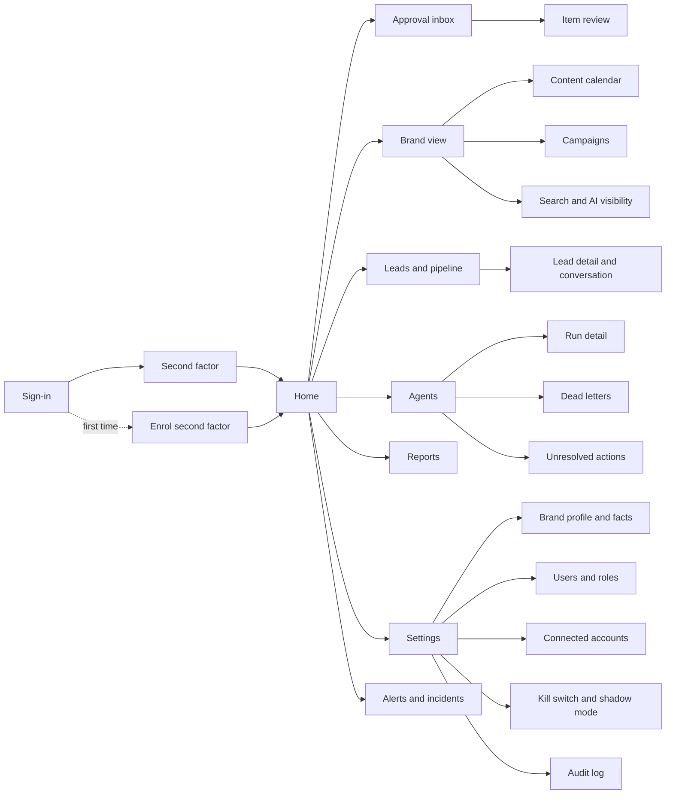
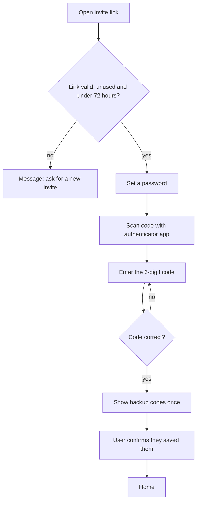
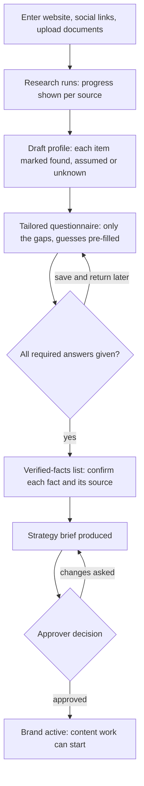
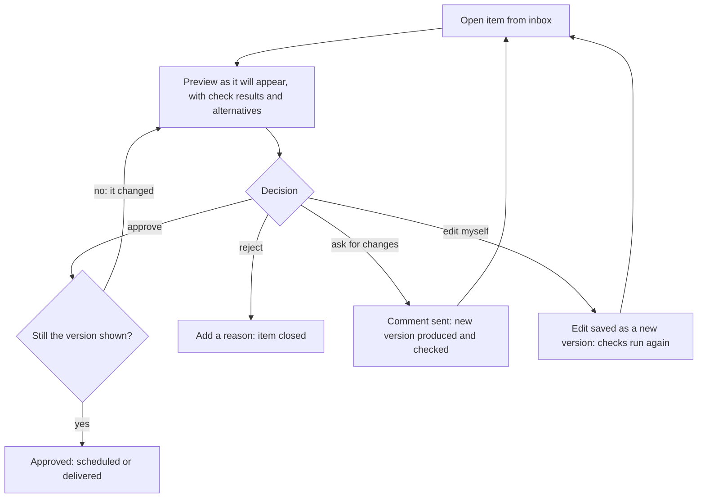
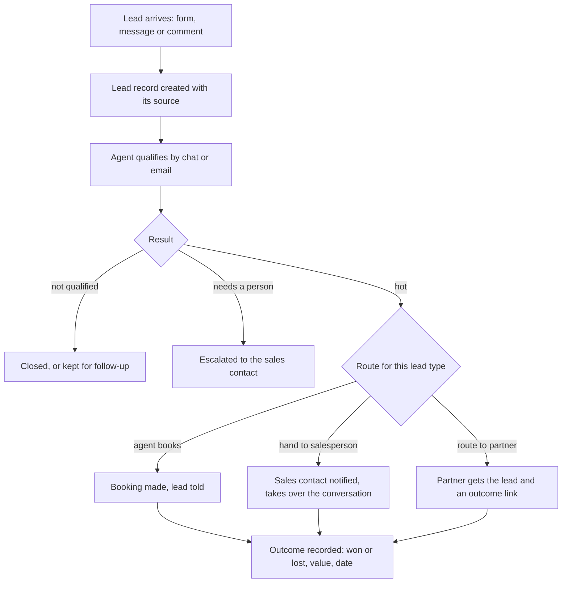

# AI Marketing Agency Platform — App Flow

| Document control | |
|---|---|
| Version | 2 |
| Status | **Approved** |
| Approved by | Sachin Tripathi, platform owner, on 2026-10-04 ("app-flow - approved") |
| Date | 2026-10-04 |
| Owner | Sachin Tripathi (platform owner) |
| Prepared by | Claude Code |
| Canonical source | `docs/app-flow/2026-10-04-app-flow.md`. The Word file is generated from it. |
| Changes in version 2 | Owner decisions of 2026-10-04 applied: flexible bulk approval, calendar approval by period (weekly by default), customisable reminders and escalation, no second factor for Viewers, Home leads with results and progress. |
| Based on | Master PRD version 3 (approved), Architecture version 2 (approved), Phase 1 spec version 3 (approved) |

## 1. Purpose and scope

This document describes the dashboard at `marketing.sarathi.gvcc.in` from the user's side: every screen, who can reach it, and how a person moves through each task from start to finish, including what happens when something goes wrong.

It covers the whole product in the PRD. Each screen and flow is tagged with the phase that delivers it, so the Phase 1 screens can be built without waiting for the rest.

| Tag | Meaning |
|---|---|
| Phase 1 to Phase 5 | The five build phases for the Aztek pilot (architecture section 19) |
| After pilot | PRD priority P1: paid ads, landing pages, tests, email, influencer, budgets, second brand |
| For sale | PRD priority P2: self-serve sign-up, billing, contracts, managed tier, client approvers |

**What is decided and what is proposed.** The roles, permissions, approval rules and data behind each screen come from the approved documents. Screen names, addresses, layout and the order of steps are proposals in this document.

## 2. Who uses the dashboard

| Role | Sees | Typical tasks |
|---|---|---|
| **Platform owner** | Every brand | Approve for Aztek and 11oils, manage brands and users, kill switch, incidents, costs |
| **Brand admin** | One brand | Everything for their brand: profile, users, connections, budgets, approvals |
| **Brand approver** | One brand | Review and approve or reject items |
| **Sales contact** | Their own leads in one brand | Take over hot leads, record outcomes |
| **Viewer** | One brand, read only | Look at content, calendar and reports |
| **Partner** | One lead, through a link | Report whether a routed lead was won or lost |

The partner has no account and never sees the dashboard.

## 3. Map of the dashboard

## 4. What is on every screen

| Element | Behaviour | Phase |
|---|---|---|
| **Top bar** | Product name, current brand, notifications, user menu | 1 |
| **Brand switcher** | The platform owner picks a brand or "all brands". Everyone else is fixed to their brand and sees no switcher. | 1 |
| **Side menu** | Home, Approval inbox (with a count), Brand, Leads, Agents, Reports, Settings. Items a role cannot use are not shown. | 1, growing by phase |
| **Notifications** | A bell with a count. Opens a list; each entry links to the item. | 1 |
| **Status banner** | A coloured bar across the top when the kill switch is on, shadow mode is on, a connection is lost, or items are overdue for approval (section 7.1) | 1 |
| **Overdue pop-up** | A window listing items overdue for approval, shown when an item becomes overdue and at each sign-in until none remain (section 7.1) | 1 |
| **Stop button** | For owner and brand admin: one tap from any screen to the kill switch | 1 |
| **Empty state** | Each list says what will appear there and what causes it | 1 |
| **Loading and errors** | A failed load says what failed and offers a retry. Nothing fails silently. | 1 |
| **Session timeout** | After the idle limit, the screen returns to sign-in and comes back to the same place afterwards | 1 |

### 4.1 Home

Home leads with **results and progress**, as the owner asked. Approvals and problems follow.

| Order | Block | Shows |
|---|---|---|
| 1 | Results | Each brand's key figures against target for the current period: leads, content published, organic visibility, and spend where it applies |
| 2 | Progress | Where work stands: onboarding stage, this week's calendar (planned, in production, awaiting approval, approved, published), campaigns running, agents active or blocked |
| 3 | Waiting for you | Count of items awaiting approval and questions from agents, with the oldest wait |
| 4 | Problems | Failed jobs, unresolved actions, lost connections, open incidents. Shown only when there are any, and then also as a banner. |

In Phase 1 there are no results yet, so block 1 shows the trivial agent's runs and cost, and block 2 shows job progress.

## 5. Flows

Each flow lists who does it, what starts it, the steps, and what happens when it goes wrong.

### 5.1 First sign-in and second-factor enrolment (Phase 1)

**Who:** every user except Viewer, who signs in with email and password only (owner decision, 2026-10-04). **Starts with:** an invite email.

1. The user opens the invite link.
2. They set a password.
3. They scan a code with an authenticator app and enter the 6-digit code it shows.
4. Backup codes are shown once. The user confirms they have saved them.
5. They land on Home.

**If it goes wrong:** an expired or used link shows a message and nothing else. Leaving before step 4 means the next sign-in returns to enrolment; no other screen is reachable until it is finished.

### 5.2 Sign-in and recovery (Phase 1)

1. Email and password.
2. The 6-digit code, or a backup code.
3. Home, or the screen the user was on before a timeout.

| Situation | What the user does | What happens |
|---|---|---|
| Forgot password | "Forgot password", then the emailed link | The link works once and for 30 minutes. All existing sessions end. The second factor is still required. |
| Lost authenticator | Uses a backup code | The code is used up. The user is told by email. |
| No backup codes left | Asks the platform owner | The owner resets the second factor from Users and roles. The user enrols again at next sign-in. |
| Too many wrong attempts | Waits | The account is locked for a period and the attempts are recorded |

### 5.3 Inviting and managing users (Phase 1)

**Who:** platform owner, brand admin. **Where:** Settings, Users and roles.

1. Choose "Invite user", enter an email and pick a role.
2. The invite is sent. It shows in the list as pending with its expiry time.
3. Once accepted, the user shows as active.
4. Changing a role, removing a user or resetting a second factor asks for the admin's own 6-digit code first.

A brand admin can invite only into their own brand and cannot create a platform owner.

### 5.4 Onboarding a brand (Phase 2)

**Who:** platform owner for Aztek and 11oils; brand admin for outside clients.

1. **Intake.** Website address, social profile links, and any brochures or decks.
2. **Research.** A progress screen shows each source being read. The user can leave and come back.
3. **Draft profile.** Each item is marked found, assumed or unknown, with its source.
4. **Questionnaire.** About 20 to 30 questions, mostly multiple choice, each saying why it is asked. Answers save as they are typed.
5. **Verified facts.** Each fact is confirmed or corrected, with its source and a review date. Nothing becomes a fact without this step.
6. **Strategy brief.** Positioning, audiences, themes, channel plan and 90-day goals. It arrives in the approval inbox.
7. **Approval.** Until the brief is approved, no content work starts.

**If it goes wrong:** a source that cannot be read is listed as such and the questionnaire asks about it. A fact the user rejects is removed from the profile.

### 5.5 Connecting accounts (Phase 3)

**Who:** platform owner, brand admin. **Where:** Settings, Connected accounts.

1. Choose a platform and "Connect".
2. Enter the 6-digit code.
3. The platform's own consent screen opens. The user signs in there and agrees to the listed permissions. No password is typed into the dashboard.
4. Back on the dashboard, the account shows as connected, with its permissions and expiry.

| Situation | What the user sees |
|---|---|
| Consent cancelled | "Not connected", with no change |
| Connection lost later | A banner, the affected items held, and a "Reconnect" button |
| Disconnect | Takes effect at once; scheduled items for that account are held |

### 5.6 Reviewing and approving an item (Phase 1 basic, Phase 3 full)

**Who:** platform owner, brand admin, brand approver. **Starts with:** a notification or the inbox count.

1. The inbox lists waiting items, oldest first, with type, brand, channel and how long each has waited.
2. Opening an item shows it as it will appear on the channel, plus the check results, the facts it relies on with their sources, any AI-generated parts labelled, and the alternative versions.
3. The approver chooses one of four actions: approve, reject, ask for changes, or edit.
4. **Approve** applies to exactly the version on screen. If a newer version exists, the screen reloads and nothing is approved.
5. **Ask for changes** sends the comment to the agent. The new version returns to the inbox after its checks.
6. **Edit** saves the approver's change as a new version. It goes through the checks before it can be approved.
7. After the revision limit, the item is marked "needs your decision" and is not revised again automatically.

**Approving several items at once.** This is a setting per brand and per kind of item, so it can be loosened or tightened without a code change.

- The approver ticks items in the inbox, or uses "select all of this kind", then approves or rejects them together.
- Each item is still approved against its own version. If one has changed, that one is skipped and reported; the rest go through.
- Whether a kind may be approved in bulk is set in Settings, Approval settings. The proposed starting point: allowed for social posts, routine replies and article drafts; not allowed for paid campaigns.
- Four kinds are never approved in bulk, whatever the setting: budgets, contracts, the strategy brief and verified facts.

In Phase 1 the only items are those from the trivial agent, and approving does not publish anything.

### 5.7 Publishing and unresolved actions (Phase 3)

Publishing needs no user action after approval. The user is involved only when the product cannot tell whether something was posted.

1. An approved item shows as scheduled on the content calendar.
2. When it is posted, it shows as published with a link to the post.
3. If the outcome is unknown, the item shows as "checking" while the product asks the platform.
4. If that cannot settle it, the item appears under Agents, Unresolved actions, with what was sent, when, and what the platform shows.
5. A person marks it "posted" or "not posted". Until then it is not sent again.

### 5.8 Campaigns and budgets (Phase 3 for organic, After pilot for paid)

**Who:** platform owner, brand admin.

1. The strategist agent proposes a campaign: objective, audience, channels, dates, target numbers and, for paid, a budget cap.
2. It arrives in the inbox as a campaign approval.
3. Approving it lets the agents produce its content.
4. **Calendar approval.** Content is approved by period. The period is a setting per brand: per item, per day, or per week. **The default is one week.** The approver opens the week, sees every item with its preview and checks, can remove or send back individual items, and approves the rest in one step. Each approved item is still recorded against its own version.
5. The campaign screen shows results against its targets and, for paid, spend against the cap.
6. A request to raise a cap is a new approval. The agent never exceeds a cap on its own.

### 5.9 A lead, from arrival to outcome (Phase 4)

**Sales contact's view**

1. A notification says a hot lead is waiting, with a summary and the conversation so far.
2. "Take over" stops the agent replying. The contact replies from the lead screen.
3. They move the lead through the pipeline stages and record the outcome.

**Partner's view**

1. The partner receives the lead's details and a link.
2. The link opens a single page: won or lost, value, date. No sign-in.
3. Reminders follow if nothing is recorded. After the last one, the lead shows "outcome unknown" to the brand, never "lost".

### 5.10 Public replies and escalations (Phase 4)

1. Routine questions are answered automatically from the approved answers. They appear in a log, not in the inbox.
2. Anything unusual, negative or below the confidence threshold appears in the inbox as a reply to approve, with the suggested answer.
3. The approver sends it, edits it or marks it "no reply".
4. Each week a sample of automatic replies appears for review. Marking one as wrong records an incident and pauses that answer.

### 5.11 Stopping everything (Phase 1)

**Who:** platform owner, brand admin. **Reached from:** the stop button on any screen.

1. Choose the scope: the whole brand, one channel or one agent.
2. Enter the 6-digit code.
3. A red banner appears on every screen for that brand. Waiting work is held; nothing further is sent.
4. The screen lists what was held and anything already in flight that could not be recalled.
5. "Release" needs the code again. Held work resumes.

Shadow mode sits on the same screen. With it on, everything is produced and approved as usual and nothing is sent.

### 5.12 Watching the agents (Phase 1)

**Who:** platform owner, brand admin.

1. **Agents** lists each agent with its live version, whether it is running, idle or blocked, and its cost this month.
2. Opening an agent shows its runs. Opening a run shows its jobs, attempts, model calls and cost.
3. **Dead letters** lists jobs that used all their attempts, with the error. Each can be requeued or cancelled.
4. Model calls flagged as possible duplicates or unknown are listed for review.

### 5.13 Agents asking a question (Phase 2)

1. When an agent meets something it does not know, it does not guess. A question appears in the inbox with why it is asked.
2. The user answers. If the answer is a fact, it goes to the verified-facts list after confirmation.
3. The work that was waiting resumes.

### 5.14 Reports (Phase 5)

1. **Reports** lists weekly and monthly reports per brand.
2. Each shows output, reach, leads, pipeline, spend, results against targets, and what the agents will change next.
3. Clicking a figure shows what is behind it: the content, the leads and the sales it counts.
4. Reports can be downloaded.

### 5.15 Audit log (Phase 1)

**Who:** platform owner, brand admin (own brand).

1. Filter by brand, person, action and time.
2. Each entry shows who did what, when, and the before and after.
3. "Verify now" checks the chain and shows the result and the time of the last export.

### 5.16 Settings (Phase 1, growing by phase)

| Area | Contents | Phase |
|---|---|---|
| Brand | Name, status, shadow mode | 1 |
| Users and roles | Invite, change role, remove, reset second factor | 1 |
| Kill switch and shadow mode | As in 5.11 | 1 |
| Approval settings | Which kinds may be approved in bulk; calendar approval period; reminder timing and count | 1 for reminders, 3 for bulk and calendar |
| Audit log | As in 5.15 | 1 |
| Brand profile and verified facts | View, correct, add; each fact with source and review date | 2 |
| Safety rulebook | Forbidden topics and claims, tone limits, pause dates | 2 |
| Approved answers | The answers routine replies may use | 4 |
| Connected accounts | As in 5.5 | 3 |
| Approved link domains | Where content may link to | 3 |
| Budgets and cost ceilings | Ad caps, tool and model cost limits | After pilot |
| Data | Export the brand's data; delete a person's data | 4 |

### 5.17 A client approver at an outside company (For sale)

1. The platform owner or the client's brand admin invites the approver.
2. They enrol as in 5.1.
3. They see only their brand's inbox, calendar and reports.
4. A notification arrives by email when an item waits. The link opens that item after sign-in.
5. They approve, reject, comment or edit as in 5.6. They cannot change settings, connections or budgets.

### 5.18 Self-serve sign-up and leaving (For sale)

1. **Sign-up:** choose a plan, accept the agreement, pay, then begin onboarding (5.4) and connect accounts (5.5).
2. **Leaving:** the brand admin requests it. All sending stops, connections are revoked, the brand's data is offered for download, and it is deleted after the retention period with a confirmation.

## 6. Screen inventory

Addresses are proposals. A brand's screens sit under its own address so one brand's link can never open another's data.

| Screen | Address | Roles | Phase |
|---|---|---|---|
| Sign-in | `/sign-in` | All | 1 |
| Second factor | `/sign-in/verify` | All | 1 |
| Enrol second factor | `/enrol` | All except Viewer | 1 |
| Accept invite | `/invite/{token}` | Invited person | 1 |
| Recover password | `/recover` | All | 1 |
| Home | `/` | All signed in | 1 |
| Approval inbox | `/b/{brand}/inbox` | Owner, admin, approver | 1 |
| Item review | `/b/{brand}/inbox/{item}` | Owner, admin, approver | 1 |
| Agents | `/b/{brand}/agents` | Owner, admin | 1 |
| Run detail | `/b/{brand}/agents/runs/{run}` | Owner, admin | 1 |
| Dead letters | `/b/{brand}/agents/dead-letters` | Owner, admin | 1 |
| Audit log | `/b/{brand}/settings/audit` | Owner, admin | 1 |
| Users and roles | `/b/{brand}/settings/users` | Owner, admin | 1 |
| Kill switch and shadow mode | `/b/{brand}/settings/safety` | Owner, admin | 1 |
| Brand settings | `/b/{brand}/settings` | Owner, admin | 1 |
| Approval settings | `/b/{brand}/settings/approvals` | Owner, admin | 1 |
| All brands | `/brands` | Owner | 1 |
| Onboarding | `/b/{brand}/onboarding` | Owner, admin | 2 |
| Brand profile and facts | `/b/{brand}/settings/profile` | Owner, admin | 2 |
| Safety rulebook | `/b/{brand}/settings/rules` | Owner, admin | 2 |
| Content calendar | `/b/{brand}/calendar` | Owner, admin, approver, viewer | 3 |
| Campaigns | `/b/{brand}/campaigns` | Owner, admin, approver, viewer | 3 |
| Search and AI visibility | `/b/{brand}/visibility` | Owner, admin, approver, viewer | 3 |
| Connected accounts | `/b/{brand}/settings/connections` | Owner, admin | 3 |
| Unresolved actions | `/b/{brand}/agents/actions` | Owner, admin | 3 |
| Leads and pipeline | `/b/{brand}/leads` | Owner, admin, sales contact (own leads) | 4 |
| Lead detail | `/b/{brand}/leads/{lead}` | Owner, admin, sales contact (own leads) | 4 |
| Reply log | `/b/{brand}/replies` | Owner, admin | 4 |
| Partner outcome page | `/p/{token}` | Partner, no account | 4 |
| Reports | `/b/{brand}/reports` | Owner, admin, approver, viewer | 5 |
| Alerts and incidents | `/alerts` | Owner, admin | 1 |
| Budgets and costs | `/b/{brand}/settings/budgets` | Owner, admin | After pilot |
| Sign-up and billing | `/sign-up`, `/b/{brand}/billing` | New customer, admin | For sale |

## 7. Notifications

| Event | Who is told | How | Phase |
|---|---|---|---|
| An item is waiting for approval | The brand's approvers | Email, bell | 1 |
| An item is still waiting | The brand's approvers: up to three reminders, then escalation (section 7.1) | Email, bell | 1 |
| An item is overdue (escalated) | The original approver and the person escalated to | Pop-up window, dashboard banner, email | 1 |
| An agent has a question | Approvers | Email, bell | 2 |
| A job is in dead letters | Owner | Email and second channel | 1 |
| Kill switch set or released | Owner and brand admin | Email and second channel | 1 |
| A connection is lost | Owner and brand admin | Email, banner | 3 |
| An action cannot be resolved | Owner and brand admin | Email and second channel | 3 |
| A hot lead is waiting | The sales contact | Email and second channel | 4 |
| A reply needs approval | Approvers | Email, bell | 4 |
| A cost or budget limit is near or reached | Owner and brand admin | Email, bell | After pilot |
| A severity 1 incident | Owner | Email and second channel, at once | 1 |
| Backup code used, second factor reset, password changed | The user concerned | Email | 1 |

### 7.1 Reminders and escalation

All of these are settings per brand.

| Setting | Default (proposed) |
|---|---|
| Time before the first reminder | 24 hours |
| Number of reminders | 3 (the owner asked for 2 to 3) |
| Gap between reminders | 24 hours |
| After the last reminder | Escalate |

**What "escalate" means.** The item is marked overdue and goes to the next person up: from a brand approver to the brand admin, and from there to the platform owner. Where the platform owner is already the approver, as for Aztek and 11oils, the item is marked overdue and its place in the calendar is held.

**How an overdue item is shown (owner decision, 2026-10-04)**

| Element | Behaviour |
|---|---|
| **Pop-up window** | Opens over whatever screen the person is on, as soon as an item becomes overdue, and again at each sign-in while any item is still overdue. It lists the overdue items with how long each has waited, and offers "Review now" (opens the first item) and "Later". It cannot be dismissed without choosing one. |
| **Banner** | A coloured bar across the top of every dashboard screen: "N items overdue for approval", with a link to the inbox filtered to them. It stays until every overdue item has been approved or rejected. "Later" on the pop-up does not remove it. |
| **Who sees them** | Everyone who can approve that item: the original approver and the person it was escalated to |
| **On a phone** | Both appear; the pop-up fills the screen |

**Silence is not approval.** If nobody responds to an item, even after every reminder and after escalation, the item stays unapproved and is not published. It waits until a person approves or rejects it. Escalation only changes who is asked; it never makes the decision. Example: a post planned for Tuesday that nobody has approved by Tuesday is not posted on Tuesday. It shows as overdue and goes out only after someone approves it.

## 8. On a phone

One person approves and responds to incidents, so these must work on a phone-sized screen from Phase 1:

- Sign-in with the second factor.
- The approval inbox and item review, including approve, reject and comment.
- The stop button and the kill switch screen.
- Alerts, dead letters and unresolved actions.

Editing long content, onboarding and reports are designed for a larger screen and remain usable, not optimised, on a phone.

## 9. Decisions and open points

**Decided by the owner on 2026-10-04**

| # | Point | Decision |
|---|---|---|
| 1 | Approving several items at once | Flexible: a setting per brand and per kind of item (5.6) |
| 2 | Calendar approval | Flexible: per item, per day or per week. Default one week (5.8). |
| 3 | Waiting items | Customisable. Two to three reminders, then escalation. Confirmed: escalation, not automatic approval. An overdue item is shown as a pop-up window and a dashboard banner (7.1). |
| 4 | Second factor for Viewers | Not required |
| 5 | What Home leads with | Results and progress (4.1) |

**Still open**

| # | Point | Affects |
|---|---|---|
| 6 | The second alert channel (owner item A11) | Section 7 |
| 7 | The defaults in 5.6 and 7.1 (24-hour reminder timing; which kinds may be approved in bulk) were approved with this document. They are settings and can be changed per brand at any time. | 5.6, 7.1 |
