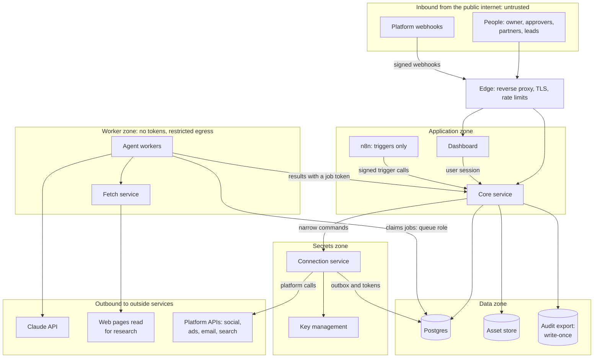
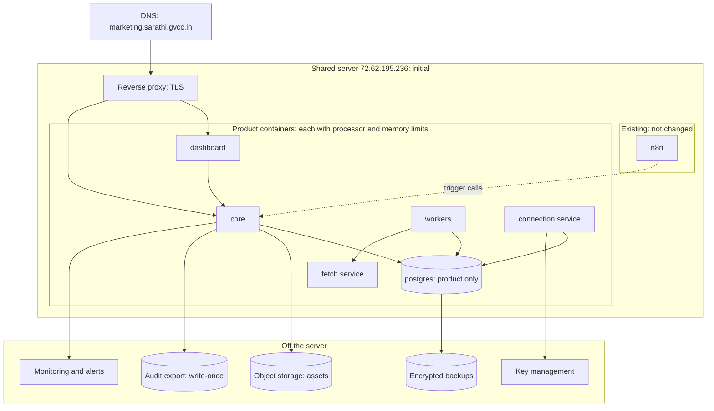
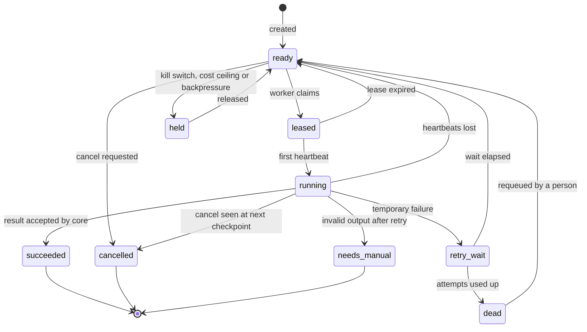
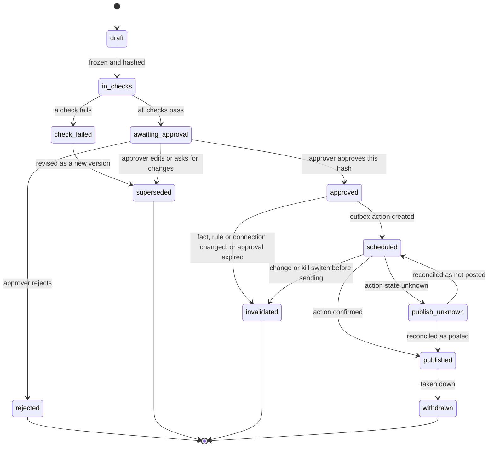
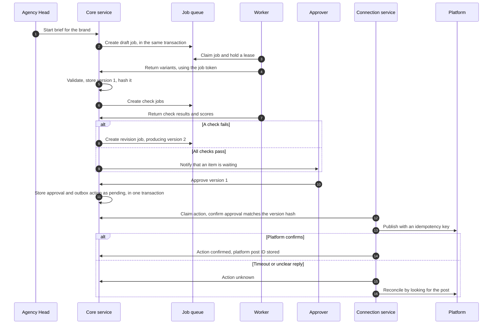
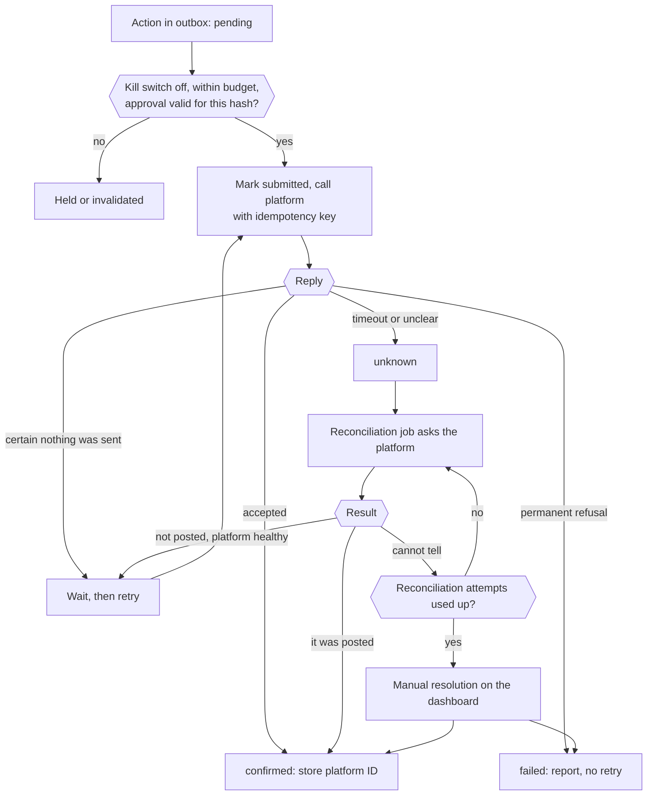
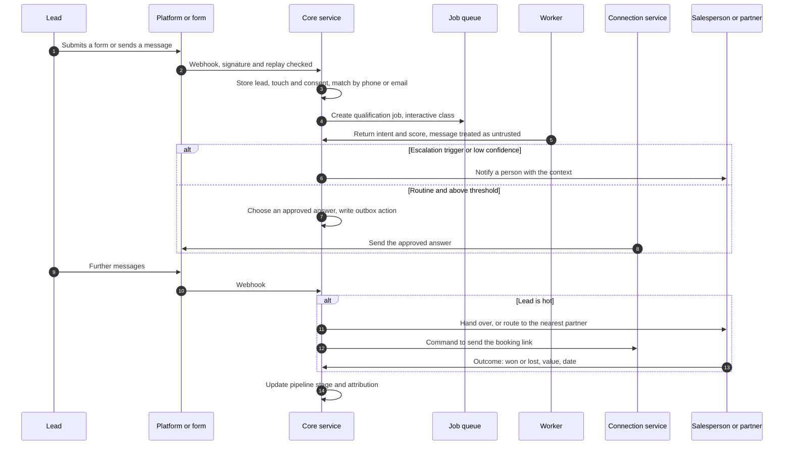

# AI Marketing Agency Platform — Architecture

| Document control | |
|---|---|
| Version | 2 |
| Status | **Approved** |
| Approved by | Sachin Tripathi, platform owner, on 2026-10-04 ("Architecture Version 2 — Approved") |
| Scope of approval | The whole of version 2, including all nine decision records in section 20 |
| Date | 2026-10-04 |
| Owner | Sachin Tripathi (platform owner) |
| Prepared by | Claude Code |
| Canonical source | `docs/architecture/2026-10-04-architecture.md`. The Word file is generated from it by `tools/build-docs/md2docx.js` and is never edited by hand. |
| Implements | Master PRD version 3, approved 2026-10-04. Canonical source `docs/prd/2026-10-03-ai-marketing-agency-prd.md`; Word copy `docs/prd/ai-marketing-agency-prd.docx`. |
| Changes in version 2 | Diagrams, terminology, queue rules, outbox and reconciliation, approval bound to content version, security architecture, action commands, decision records. |
| Corrections after approval | 2026-10-04: approval status and decision-record statuses made consistent; sections 21 and 22 updated to reflect choices made in the Phase 1 spec. No design content changed. |

Requirement IDs in brackets, such as (AI-6) or (SEC-4), refer to the PRD.

## 1. Purpose and scope

This document fixes the shape of the system: components and trust boundaries, deployment, tenant isolation, how agents and jobs run, how approvals and publishing stay correct under failure, and the security design. It is the basis for the per-phase specs and for estimation. Tool choices that belong to a later phase are made in that phase's spec.

Values described as "initial settings" are engineering starting points. They are tuned from measurement and are not commitments to customers.

## 2. Terminology

| Term | Meaning |
|---|---|
| **Brand** | One tenant. Every record belongs to exactly one brand. |
| **Agent** | One of the 22 agency roles, as a named unit of work. |
| **Agent definition** | The versioned files that make up an agent: instructions, model settings, input and output shape, tools, checks. |
| **Run** | One execution of one agent definition version for one brand, from start to result. A run is made of one or more jobs. |
| **Job** | One unit of work on the queue: a single step of a run, a check, a reconciliation, a report. |
| **Step** | What a job does: a single structured model call, a tool loop, or plain code. |
| **Content item** | A piece of work for publication: an article, a post, a video, an email, a reply. |
| **Content version** | An immutable, hashed snapshot of a content item. Any change makes a new version. |
| **Approval** | A person's decision on one specific content version, or on a budget, a strategy brief or a contract. |
| **Command** | A narrow, typed request from the core service to the connection service, such as "publish content version V to account A". |
| **Action** | One outbound effect on an outside platform, recorded in the outbox with a state. |
| **Campaign** | A planned set of content with an objective, audience, channels, budget, targets and dates. |
| **Connection** | A brand's authorised link to an outside account, with its tokens. |
| **Touch** | A recorded interaction between a person and a brand, with its source. |

## 3. Components and trust boundaries

| Component | Responsibility | Owns |
|---|---|---|
| **Dashboard** | Sign-in, inbox, agent status, brand views, leads, reports, settings, manual resolution | Nothing; it calls the core service |
| **Core service** | The only writer of business data. Tenancy, roles, content versions, approvals, leads, pipeline, cost ledger, audit log, outbox entries, job creation | Business records and the rules about them |
| **Agent workers** | Run steps by calling the Claude API. Return structured results. | Nothing durable; no tokens |
| **Fetch service** | The only way a worker reads the open web. Blocks unsafe destinations. | Nothing durable |
| **Connection service** | Holds every connection's tokens. Makes every outbound platform call. Receives platform webhooks for token and delivery events. | Tokens, action dispatch, reconciliation |
| **Key management** | Holds the master key that protects token keys | The master key |
| **Postgres** | System of record, job queue and outbox | All data |
| **Asset store** | Uploaded and generated media, private per brand | Media files |
| **n8n** | Time-based triggers and connections that need no tenant token | Schedules |
| **Claude API** | Model calls | Nothing of ours beyond provider retention terms |

**Boundary rules**

- Nothing in the worker zone holds a platform token or can reach a platform.
- Only the connection service reaches platforms, and only on a command from the core service.
- Only the core service writes business data. Workers return results; the core service validates and stores them.
- Everything arriving from the public internet is untrusted: browser input, webhooks, web pages, lead messages, uploaded files.

## 4. Deployment

**Decision (owner, 2026-10-04): start on the same server as n8n and move when load requires it.**

How n8n is installed on that server, and the server's processor, memory, disk and current load, have not been inspected. The diagram shows the intended layout for the product; the existing side is drawn only as "not changed". The inspection happens before phase 1 is deployed.

**Conditions for sharing the server**

- **Separate containers and database.** The product does not use n8n's database or files.
- **Resource limits** on every product container, so it cannot starve the existing workflows (REL-13).
- **Private networks.** The worker zone and the secrets zone are separate container networks. Workers cannot reach the connection service or the database's business tables.
- **Backups leave the server** daily, encrypted, from day one (REL-1).
- **Built to move.** Moving means restoring a backup on a new server and changing the DNS record (REL-2).

| Move to a separate server when | Why |
|---|---|
| Sustained high processor or memory use, or the n8n workflows slow down | The owner's stated trigger |
| Before the first outside client goes live | Other companies' lead data and tokens should not share a server with unrelated workloads |
| Video or image processing runs on the server itself | Heavy and bursty |
| Availability or recovery targets cannot be met on one server | PRD section 21 |

## 5. Tenant isolation and database access

- **Every table carries a brand ID** (P0-1).
- **Row-level security is enabled and forced on every business table**, so it applies even to the table's owner.
- **The brand is set per transaction, not per connection.** Each request or job opens a transaction and sets the brand for that transaction only. This is what makes connection pooling safe: a pooled connection never carries one brand's setting into another brand's request.
- **Pooling rule.** Transaction-level pooling is allowed. Any code path that sets the brand outside a transaction is a defect, and a test fails the build if one exists.

| Database role | Used by | Can do |
|---|---|---|
| Migration role | Deployments only | Change the schema. Never used at run time. |
| Application role | Core service | Read and write business tables, subject to row-level security. Cannot bypass it. |
| Queue role | Workers | Claim and update jobs. No access to business tables. |
| Connection role | Connection service | Outbox, connections and token tables only |
| Audit-writer role | Core service, for the audit log only | Insert only. No update, no delete. |
| Owner-view role | The platform owner's cross-brand screens | Read across brands through named, audited functions only |
| Read-only role | Reports and exports | Read, subject to row-level security |

- **Workers do not read business tables.** A job carries the input it needs, prepared by the core service for one brand.
- **Tested, not assumed.** A suite tries to cross brands through every API and every role and must fail every time. Passing it is gate 0.
- **Assets** sit under a per-brand path and are served through signed, expiring links.

## 6. How agents are built

### 6.1 An agent is a definition

Each of the 22 roles is an agent definition in the repository: instructions, model ID and effort, input and output shape, permitted tools, and the checks its output must pass. A definition has a version. The database records the live version, and every run stores the versions that produced it (AI-1). A version goes live only after its evaluation set passes and the owner releases it (AI-3). Going back one version is a single action (AI-17).

### 6.2 Three kinds of step

| Step kind | Used for | Example |
|---|---|---|
| **Single structured call** | One input, one checked output | Write a caption; score a draft; extract claims |
| **Tool loop** | Work needing several look-ups the model chooses | Onboarding research |
| **Plain code** | Anything needing no judgement | Scheduling, link tagging, cost totals, lead routing |

### 6.3 The Agency Head

A coded state machine that moves work between agents, tracks status and escalates. It uses a model call only to plan and prioritise. It is not a model in control of the others.

### 6.4 Maker and checker

Every check is a separate job with its own definition and version (AI-18). Order: creative quality (AI-19), fact check with claim-to-source links (AI-5), unsafe advice (AI-10), brand and tone (AI-8), moderation (AI-7), platform and advertising policy (AI-9). Each returns a score; below its threshold the item goes to a person (AI-4).

### 6.5 Untrusted content

- Outside content is wrapped and labelled untrusted.
- **A step that reads untrusted content has no action tools.** It returns a structured result only.
- **Structured output is not treated as safe.** A hostile page can place text inside a valid field. So no model output is ever passed to a platform as free text chosen by the model; see section 11.

## 7. Job queue

The queue lives in Postgres. Its main advantage is that creating a job and changing business data happen in one transaction, so a job is never created for a change that did not commit, and never lost for one that did.

### 7.1 Rules

| Concern | Rule |
|---|---|
| **Lease** | A worker claims a job by locking its row and setting a lease expiry. No other worker can claim it while the lease is valid. |
| **Visibility timeout** | The lease length, set per job class. When it passes without renewal, the job becomes claimable again. |
| **Heartbeat** | A running worker renews its lease at a fixed interval and records it. Each worker also reports that it is alive. |
| **Stuck-job recovery** | A reaper returns jobs with expired leases to the queue and counts an attempt. A watchdog alerts on any job waiting longer than its class allows, and cancels any job running beyond its maximum time. |
| **Attempts** | Each job class has a maximum. Waits between attempts grow, with random variation so retries do not arrive together. |
| **Dead letter** | A job that uses all its attempts is kept in a dead state, never deleted. It raises an alert, appears on the dashboard, and can be requeued or cancelled by a person. |
| **Safe to repeat** | Every job can run twice without harm. Outside effects go only through the outbox (section 10). A multi-step job saves each finished step, so a repeat resumes and does not pay for the same model call again. |
| **Priority** | Four classes: interactive, publishing, production, bulk. A higher class is always claimed first. |
| **Per-brand concurrency** | Each brand has a cap on jobs running at once, per class. Claiming rotates across brands, so one brand's backlog cannot starve another. |
| **Backpressure** | When waiting jobs pass a limit, the core service stops creating bulk and production jobs, then slows schedules, and alerts. When the model provider signals a rate limit, a shared limiter slows every worker. |
| **Cancellation** | A cancel request is a flag. Workers check it before every model call and between steps. The kill switch moves a brand's waiting jobs to a held state; nothing is deleted. An action already submitted to a platform cannot be cancelled; it is reconciled. |

### 7.2 Initial settings

| Job class | Examples | Lease | Heartbeat | Max attempts | Max run time |
|---|---|---|---|---|---|
| Interactive | Lead qualification, routine reply | 2 minutes | 20 seconds | 3 | 5 minutes |
| Publishing | Dispatch, reconciliation | 2 minutes | 20 seconds | 5 | 10 minutes |
| Production | Drafting, checks, visuals | 10 minutes | 30 seconds | 3 | 30 minutes |
| Bulk | Research, evaluation runs, reports | 15 minutes | 30 seconds | 3 | 2 hours |

A job is treated as abandoned after three missed heartbeats. Per-brand concurrency starts at 2 interactive, 2 publishing, 3 production and 1 bulk.

### 7.3 When to move to a dedicated queue

The queue sits behind one interface in the code, so the implementation can be replaced without changing agents. Move when any of these holds for a sustained period:

- Job throughput stays above about 50 jobs a second.
- The time to claim a job passes 1 second at the 95th percentile.
- Queue activity slows ordinary business queries, or the job table's maintenance cannot keep up.
- Workers need to run on several servers or in more than one region.

If the queue moves out of Postgres, job creation loses its shared transaction with business data. The outbox pattern in section 10 then also carries job creation.

## 8. State machines

### 8.1 Job

A run's state is derived from its jobs: running while any job is active, succeeded when all have succeeded, and otherwise the most serious state among them.

### 8.2 Content version and approval

**An approval belongs to one content version, identified by its hash.** A content version never changes. Any edit, by an agent or by the approver, creates a new version, and the earlier approval no longer applies to it.

Rules that follow from this:

- **The connection service publishes a version only if a valid approval exists for that exact hash.** It checks this itself at send time; it does not trust the caller.
- **An approver's edit creates a new version.** It runs through the checks again before it can be approved.
- **An approval is invalidated** when a verified fact the version relies on changes or expires, when the brand's safety rules change, when the target connection is lost, or when the approval is older than the brand's limit.
- **Budgets, strategy briefs and contracts** are approved the same way: against an immutable version.

## 9. Content creation, approval and publishing

Ownership at each point: the core service owns the content version and the approval; the queue owns the job's lease; the connection service owns the action from "pending" until it is confirmed, failed or handed to a person.

## 10. Outbound actions: outbox, states and reconciliation

Storing a key before calling a platform is not enough on its own. The platform can publish successfully while our request times out. The design therefore treats "we do not know" as a state of its own.

### 10.1 Transactional outbox

The decision that causes an outside effect and the record of that effect are written in **one database transaction**: for example, the approval and its "pending" action. A dispatcher in the connection service then sends pending actions. An action can therefore never be sent for a decision that did not commit, and a committed decision can never lose its action.

### 10.2 Action states

| State | Meaning | Next |
|---|---|---|
| **pending** | Recorded, not yet sent | submitted, or held or invalidated |
| **submitted** | The call has been made; no final answer yet | confirmed, failed, unknown |
| **confirmed** | The platform has acknowledged it, and its ID is stored | End |
| **failed** | The platform refused it for a permanent reason, or it is certain nothing was sent and attempts are used up | End; reported |
| **unknown** | The call was made and the outcome is not known | Reconciliation only. Never retried directly. |

### 10.3 Flow

### 10.4 Rules

- **Provider idempotency keys** are sent wherever a platform supports them, so a repeated call is harmless on the platform's side too.
- **Where a platform has none**, the action carries a marker the reconciliation job can search for, such as our content version ID in a tracked link, or the exact text and time window.
- **Reconciliation jobs** run for every unknown action, on a rising schedule, and also sweep "submitted" actions older than a limit.
- **"Certain nothing was sent"** means the connection failed before the request left, or the platform returned an explicit refusal before processing. Any other failure after the request left is "unknown".
- **Manual resolution.** An action that reconciliation cannot settle appears on the dashboard with what was sent, when, and what the platform shows. A person marks it posted or not posted. Until then the content version stays in "publish unknown" and is not sent again.
- **The same pattern covers** emails, messages, replies, ad changes and payments, not only posts.

## 11. Commands and input validation

**The connection service accepts narrow commands, never model-written instructions.** A command names records by ID; it does not carry text chosen by a model.

| Command | Carries | Does not carry |
|---|---|---|
| Publish content version | Brand, connection ID, content version ID, time | The text or media; the service loads the approved version itself |
| Send approved answer | Conversation ID, approved-answer ID | Free reply text |
| Send booking link | Conversation ID, booking type | A URL |
| Apply ad change | Campaign ID, approved change ID | Budget figures or targeting text |
| Take down | Action ID | Anything else |

There is no command that names an arbitrary tool, URL, account or recipient. A new kind of outside effect needs a new command, written and reviewed in code.

**Checks enforced on every command and on every result a worker returns**

| Check | Rule |
|---|---|
| Field allowlist | Only the fields the schema names are accepted; anything else is rejected, not ignored |
| Size limits | Per field and per item, by content type and platform |
| Links | Every link in a content version must be on the brand's approved domain list. Link shorteners and redirects are resolved and checked. |
| Markup | Script and active markup are removed. Rich text is rebuilt from a small permitted set, not passed through. |
| Media | File type is verified from the file's content, not its name or declared type. Images and video are re-encoded before use. |
| Permission | The brand, the connection and the command type are checked against the caller's authority |
| Budget | Spend and cost ceilings are checked at send time |
| Destination | Fixed by the connection record; a command cannot change where something goes |

**Research and fetching**

- Workers never fetch from the web directly. They use the fetch service, or the model provider's own server-side search and fetch tools, which run outside our network.
- The fetch service allows only web addresses on standard ports, refuses internal, private and metadata addresses, pins the resolved address so it cannot change mid-request, re-checks after every redirect, limits size and time, sends no credentials, and rate-limits per brand.
- The worker zone has no other route out except the model provider.

## 12. Lead intake and conversation

- The worker classifies the message; it does not write the reply. The reply is an approved answer selected by ID (section 11).
- A second message arriving while a job is running does not start a parallel reply; conversations are processed one job at a time per conversation.
- If the model provider is down, the core service sends the approved holding message and notifies a person (AI-13).

## 13. Security architecture

### 13.1 Sign-in and multi-factor

- **Provider.** Sign-in is handled inside the core service by an established authentication library, with users stored in our own database. A hosted identity provider is the alternative; the choice is ADR-006 and is confirmed in the phase 1 spec.
- **Flow.** Email and password, then a second factor. The second factor is an authenticator app code or a passkey. One-time recovery codes are issued at enrolment.
- **Enrolment is mandatory** at first sign-in for every role that can approve, publish, spend, see lead data or administer (SEC-1). There is no bypass per user.
- **Sessions.** Server-side sessions in a secure, same-site cookie; short idle timeout; re-entry of the second factor for sensitive actions such as connecting an account, exporting data, using the kill switch or changing roles.
- **Protection.** Rate limits and lockout on sign-in; every sign-in logged.
- **Partners** have no account. Their link is single-purpose, signed, expiring, and limited to one lead's outcome.

### 13.2 Roles and permissions

The role table in PRD section 16.1 is the source. Each permission is a named check in the core service, applied on the server for every request. Row-level security is the second line: even a missed check cannot cross brands.

### 13.3 Service-to-service authentication

| Caller | Callee | Method |
|---|---|---|
| Dashboard | Core service | The user's session |
| Worker | Core service | A job token: short-lived, signed, valid for one job, one brand and one kind of result |
| Core service | Connection service | Signed service token on a private network; commands only |
| n8n | Core service | Request signed with a shared secret, with a timestamp and a single-use number. The credential is limited to trigger endpoints: it can start scheduled work, and can read or change nothing. |
| Platform | Core or connection service | Webhook signature (13.6) |

n8n's secret is stored as an n8n credential, never in a workflow field. If n8n were compromised, the attacker could start scheduled jobs early, and nothing else.

### 13.4 Keys and tokens

- **Envelope encryption.** Each connection's tokens are encrypted with a data key for that brand. Data keys are encrypted by a master key held in key management, outside the database. A copy of the database alone cannot be decrypted.
- **Rotation.** The master key is rotated on a schedule by re-wrapping data keys, with no need to re-encrypt every token. Data keys rotate on a schedule and at once after suspected exposure (PRD section 21).
- **Secrets** such as API keys and signing secrets live in the secrets store and are injected at start; they are never in the repository, in images or in logs.
- **Which key-management product** is used depends on hosting and is settled in the phase 1 spec.

### 13.5 Connecting, refreshing and revoking accounts

| Step | Rule |
|---|---|
| **Start** | The request carries a random value bound to the user's session and brand, and a proof key where the platform supports it. Only the permissions needed are requested. |
| **Callback** | Accepted only at the exact registered address. The random value must match the session. The code is exchanged server-side inside the connection service; tokens never reach the browser. |
| **Storage** | Encrypted as in 13.4. |
| **Refresh** | Done ahead of expiry by the connection service. One refresh at a time per connection, so two workers cannot both use a single-use refresh token. |
| **Failure** | The connection is marked as needing reconnection, affected actions are held, and the brand is told how to reconnect (REL-9). |
| **Revocation** | On disconnect or offboarding, the platform's revoke call is made, then the tokens are deleted. A platform's own "access removed" notice is handled the same way (REL-10). |

### 13.6 Webhooks

- **Signature.** Verified over the raw request body with the platform's secret, using a constant-time comparison. Unsigned or wrongly signed requests are rejected.
- **Replay.** A timestamp outside a short window is rejected. Each event's ID is stored; a repeated ID is acknowledged and ignored.
- **Processing.** The request is acknowledged quickly and the work is queued, so a slow job cannot cause the platform to resend.
- **Content.** Webhook bodies are untrusted and pass the checks in section 11.

### 13.7 Network egress

| Zone | May reach |
|---|---|
| Worker zone | The model provider and the fetch service only |
| Fetch service | Public web addresses, under the rules in section 11 |
| Connection service | The listed platform addresses and key management only |
| Core service | Database, asset store, audit export, monitoring, notification sender |

### 13.8 Audit log

An insert-only table is not tamper-proof on its own. Three layers:

1. **Restricted role.** Only the audit-writer role can insert. No role has update or delete. A trigger refuses both in any case.
2. **Hash chain.** Each entry stores a hash of its content together with the previous entry's hash, per brand. Changing or removing an entry breaks the chain.
3. **Export to write-once storage.** Entries and the latest chain hash are exported on a schedule to storage outside the server that does not allow overwriting or deletion within the retention period.

A scheduled job verifies the chain against the exported hashes and raises a severity 1 incident on a mismatch. Retention follows PRD section 21. Reading the log is itself logged (SEC-8).

## 14. Use of the Claude API

- **Surface.** The Messages API through the official TypeScript SDK, in our own workers.
- **Model.** `claude-opus-5-5` for every agent to begin with, with effort set explicitly per agent. Moving an agent to a cheaper model is the owner's decision and requires its evaluation set to pass on that model (AI-14).
- **Structured output** validated against a schema for every step.
- **Caching.** Stable prompt parts first, changing parts last.
- **Batch processing** for evaluation runs and bulk research.
- **Refusals** are checked before content is read and handled as an outcome.
- **Long outputs** are streamed.
- **Usage** from every reply is written to the cost ledger (P0-21).
- **Provider terms** on training and retention are checked and recorded before go-live (AI-15).

## 15. Data model (main records)

| Area | Records |
|---|---|
| Tenancy and access | Brand, user, role, membership, session, connection, encrypted token, data key |
| Brand knowledge | Brand profile, verified fact, questionnaire and answers, strategy brief, safety rulebook, approved answer, approved domain |
| Work | Campaign, content brief, content item, content version (immutable), asset, check result, approval, approval invalidation |
| Agents | Agent definition version, live version, run, job, saved step, worker, cost ledger entry, evaluation set, evaluation result |
| Distribution | Outbox action, action attempt, reconciliation result, manual resolution, platform limit counter |
| Leads and sales | Lead, touch, consent, conversation, message, opportunity, stage change, partner routing, partner outcome |
| Inbound | Webhook event (for replay protection) |
| Measurement | Metric snapshot, attribution result, report |
| Governance | Audit log entry, audit chain export, incident, escalation, kill-switch flag |

## 16. Evaluation harness

- Evaluation sets live in the repository beside the agent definitions, one per brand plus a shared one.
- A command runs an agent version against its set and reports pass or fail.
- The release step refuses to make a version live without a recorded passing run.
- Every public incident adds a case (AI-2).
- The shared set includes hostile inputs: instructions hidden in web pages, in lead messages and inside structured fields.
- Confidence thresholds are derived from these runs at gate 2 (AI-4).

## 17. What n8n does, and what it does not

| n8n does | n8n does not |
|---|---|
| Time-based triggers that call the core service | Hold any brand's token |
| Connections that need no tenant token, such as page-speed checks | Publish, send or spend for a brand |
| Notifications to the owner | Run agent prompts or store business data |
| Quick trials of a new integration | Decide anything |

New workflows only. `Sarathi Access Sync` and `Sarathi — Jira CEO snapshot` are not touched. The n8n-mcp server from `github.com/czlonkowski/n8n-mcp` is installed and connected, and is used to build and validate these workflows.

## 18. Integrations

| Integration | Route | Phase |
|---|---|---|
| Claude API | Agent workers | 1 |
| Instagram, Facebook, LinkedIn, YouTube | Connection service | 3 |
| Search Console and analytics | Connection service | 3 |
| Page-speed and keyword data | n8n or connection service; chosen in the phase 3 spec | 3 |
| Image, video and voice generation | Workers through a provider module; chosen in the phase 3 spec | 3 |
| Aztek site draft-only endpoint | Connection service | 3 |
| Email, calendar booking | Connection service | 4 |
| Ad platforms | Connection service | P1 |
| Payments and e-signature | Connection service | P2 |

## 19. How the phases map to this architecture

| Phase | Builds |
|---|---|
| **1 Foundation** | Repository, database roles and row-level security, core service, sign-in with second factor and roles, dashboard shell, approval inbox with immutable versions, audit log with hash chain and export, kill switch, job queue with the rules in section 7, cost ledger, service authentication, one trivial agent end to end |
| **2 Onboarding and strategy** | Agent definition format, evaluation harness, fetch service, research and strategist agents, questionnaire, verified facts, strategy brief |
| **3 Content and organic** | Creative agents, the six checks, asset store, connection service with outbox, reconciliation and manual resolution, account connection and refresh, publishing to four channels, SEO and GEO, shadow mode |
| **4 Leads and sales** | Webhook intake with signature and replay checks, leads, touches and attribution, qualification, approved answers, booking, handoff, partner routing and outcome links, pipeline |
| **5 Reporting** | Metric snapshots, attribution results, weekly and monthly reports |

## 20. Architecture decision records

| ADR | Decision | Status | Why | Revisit when |
|---|---|---|---|---|
| **001 Hybrid design** | A coded agent service is the core; n8n triggers and fetches | Accepted, 2026-10-04 | The PRD's versioning, isolation, duplicate protection and token rules need testable code | Not expected |
| **002 Queue in Postgres** | Jobs and the outbox live in the product database | Accepted, 2026-10-04 | Job creation shares a transaction with business data; no extra server | Any trigger in section 7.3 |
| **003 n8n boundary** | n8n holds no tenant token and runs no agent prompt | Accepted, 2026-10-04 | Credentials are per instance, not per tenant; workflows are hard to version and test | A specific token-free integration is easier there |
| **004 Connection service** | One component holds all tokens and makes all platform calls, on narrow commands | Accepted, 2026-10-04 | A compromised worker or prompt cannot publish, send or spend | Not expected |
| **005 Initial hosting** | Share the n8n server, with the conditions in section 4 | Accepted, 2026-10-04 | Lowest cost while load is small | Any trigger in section 4 |
| **006 Sign-in** | An authentication library inside the core service, with app-code and passkey second factors | Accepted, 2026-10-04 | Keeps user data in our database and avoids another vendor holding it | If a customer requires company single sign-on |
| **007 Approval bound to version** | An approval names one immutable content version by hash | Accepted, 2026-10-04 | Content cannot change between approval and publishing | Not expected |
| **008 Outbox and reconciliation** | Outside effects go through a transactional outbox with an explicit unknown state | Accepted, 2026-10-04 | A timeout must not cause a double post or a silent loss | Not expected |
| **009 Commands by ID** | The connection service loads approved records by ID; it never accepts model text | Accepted, 2026-10-04 | Hostile content inside a valid field cannot reach a platform | Not expected |

## 21. Risks and open technical questions

| # | Item | Effect |
|---|---|---|
| 1 | Platform approvals take weeks and can be refused | Blocks phase 3 publishing. Start now. |
| 2 | The shared server's capacity and layout have not been inspected | Inspect before phase 1 deployment |
| 3 | Some platforms offer no idempotency key and weak search | Reconciliation will lean on manual resolution for those; measured in phase 3 |
| 4 | Key-management product not chosen | Not needed in phase 1, which holds no platform tokens. Settled in the phase 3 spec with the connection service. |
| 5 | Passkeys are not enforced as a second factor by the chosen sign-in library by default | Phase 1 ships password plus authenticator-app code only; passkeys follow with tested enforcement (Phase 1 spec, section 3) |
| 6 | Model cost per brand is unknown until measured | Cost ledger is in phase 1 |
| 7 | One person responds to incidents (PRD open question 28) | Alerts, kill switch and manual resolution must work from a phone |
| 8 | Legal answers on retention, disclosure and overseas leads | Block phase 4 go-live |
| 9 | Image and video quality for brand use is unproven | Trial with real Aztek assets early in phase 3 |

## 22. What comes next

1. Phase 1 spec: `docs/specs/2026-10-04-phase-1-foundation.md`, version 4, approved 2026-10-04. It tightens section 13.3: the worker's token is bound to one attempt of a job, not only to the job.
2. An estimate per phase.
3. Phase 1 implementation plan, then build.
