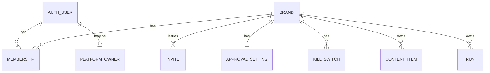
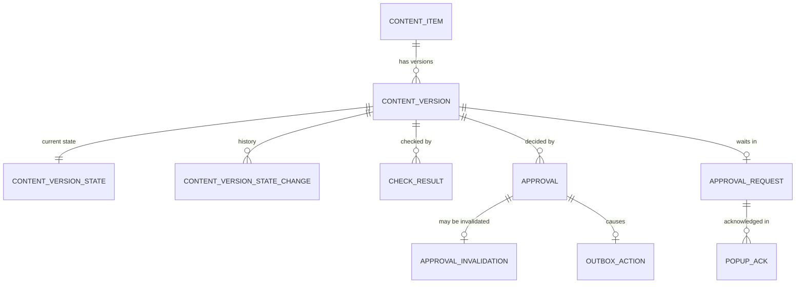
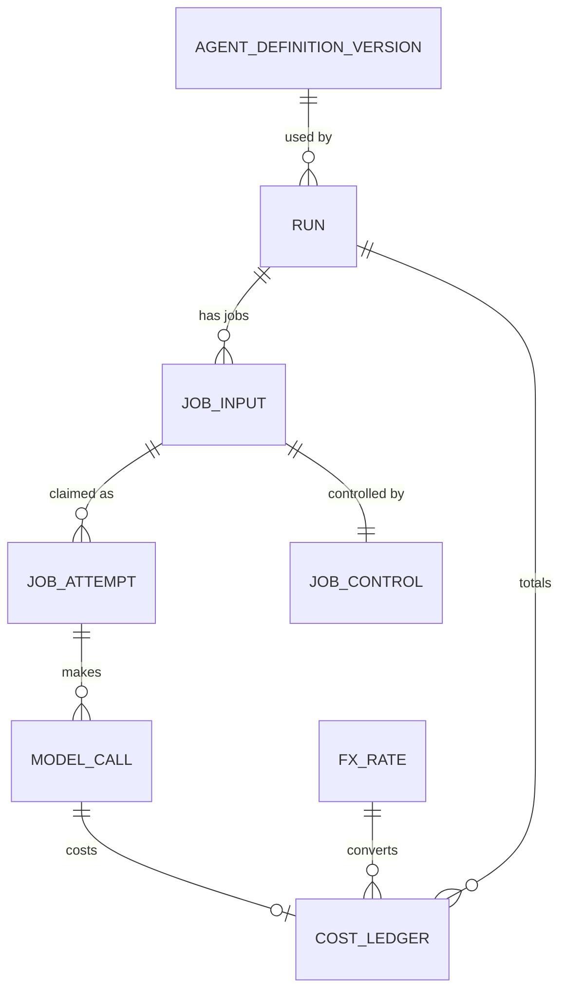

# AI Marketing Agency Platform — Database Schema

| Document control | |
|---|---|
| Version | 2 |
| Status | **Approved** |
| Approved by | Sachin Tripathi, platform owner, on 2026-10-04 ("database schema approved"). Phase 1 tables are approved to build; later-phase tables remain provisional until their own specs. |
| Date | 2026-10-04 |
| Owner | Sachin Tripathi (platform owner) |
| Prepared by | Claude Code |
| Canonical source | `docs/database/2026-10-04-database-schema.md`. The Word file is generated from it. |
| Changes in version 2 | Owner decisions of 2026-10-04: the refinements in section 12 accepted; 90-day retention for job inputs and notifications confirmed; every cost recorded in both US dollars and Indian rupees (sections 2, 7.6 to 7.8). |
| Based on | Phase 1 spec version 4, Architecture version 2, Master PRD version 3, App flow version 2, Content guidelines version 2, Tech stack version 1. All approved. |

## 1. Scope and status of each part

This document describes the whole database: every schema, table, column, key, rule and access right.

| Part | Level of detail | Status |
|---|---|---|
| **Phase 1 tables** (sections 5 to 9) | Every column, type, constraint, index and rule | Follows the approved Phase 1 spec. Approved to build. |
| **Later-phase tables** (section 10) | Table purpose, key columns and relationships | **Provisional.** Each phase's own spec finalises its tables before they are built. They are shown so the Phase 1 design is known to leave room for them. |
| **Tables owned by libraries** (section 4) | Named, not specified here | The sign-in and queue libraries generate their own tables. Their generated SQL is the source of truth. |

Section 12 lists the places where this document refines the approved Phase 1 spec.

## 2. Conventions

| Topic | Rule |
|---|---|
| Database | PostgreSQL 17.11, one database for the product |
| Identifiers | `uuid`, generated at random. Never sequential, so an ID reveals nothing and cannot be guessed. |
| Time | `timestamptz`, stored in UTC |
| Text | `text`. Email addresses use case-insensitive text. |
| Money | Whole numbers of millionths of a currency unit (`bigint`). No decimals, so no rounding errors. Every cost is stored three ways: the amount as charged with its currency, the US dollar amount and the Indian rupee amount, with the exchange rate used (section 7.8). |
| Fixed lists | Postgres enumerated types, listed in section 3.3 |
| Structured values | `jsonb`, validated by the core service before it is stored |
| Names | Lower case with underscores; tables in the singular |
| Brand scope | Every business table has `brand_id uuid not null` |
| Deletion | Business rows are not deleted in normal operation. Removal happens only through the retention and deletion processes in section 11. |
| Schema changes | Numbered plain SQL files, applied by the migration role only |

## 3. Structure

### 3.1 Schemas

| Schema | Holds | Owned by |
|---|---|---|
| `app` | All business tables | Our migrations |
| `auth` | Users, sessions, second factor | The sign-in library; generated once, reviewed and committed as a migration |
| `pgboss` | Queue rows | The queue library |
| `audit` | The audit log and its export record | Our migrations |
| `secrets` | Encrypted platform tokens and data keys | Our migrations. Created in phase 3; no other role than the connection role can read it. |

### 3.2 Rules for every brand-scoped table

1. `brand_id uuid not null`, with a foreign key to `app.brand`.
2. A unique key on `(brand_id, id)`.
3. **Every foreign key to another brand-scoped table includes `brand_id`.** A row in one brand cannot point at a row in another.
4. Row-level security is enabled and forced.
5. One policy with a read condition and a write condition, both: the row's `brand_id` equals the brand set for the current transaction.

The policy, identical on every brand-scoped table:

```
ALTER TABLE app.content_item ENABLE ROW LEVEL SECURITY;
ALTER TABLE app.content_item FORCE ROW LEVEL SECURITY;
CREATE POLICY brand_isolation ON app.content_item
  USING      (brand_id = current_setting('app.brand_id', true)::uuid)
  WITH CHECK (brand_id = current_setting('app.brand_id', true)::uuid);
```

With no brand set, the setting is empty, the comparison is never true, and no row can be read or written.

The brand is set for one transaction only, which is what makes connection pooling safe:

```
BEGIN;
SELECT set_config('app.brand_id', '<brand uuid>', true);  -- true = this transaction only
-- queries for that brand
COMMIT;
```

A foreign key that carries the brand:

```
FOREIGN KEY (brand_id, content_item_id)
  REFERENCES app.content_item (brand_id, id)
```

### 3.3 Enumerated types

| Type | Values |
|---|---|
| `brand_status` | onboarding, active, paused, offboarding, closed |
| `membership_role` | brand_admin, approver, sales_contact, viewer |
| `content_kind` | summary (phase 1 only), article, answer_page, social_post, carousel, short_video, long_video, email, ad, landing_page, reply, strategy_brief, campaign, correction |
| `version_state` | draft, in_checks, check_failed, awaiting_approval, approved, rejected, superseded, invalidated, scheduled, publish_unknown, published, withdrawn |
| `check_kind` | blocking, score |
| `approval_decision` | approved, rejected, changes_requested |
| `run_state` | created, running, succeeded, failed, needs_manual, cancelled, held |
| `job_class` | interactive, publishing, production, bulk |
| `attempt_state` | active, succeeded, failed, superseded |
| `model_call_status` | started, succeeded, failed, unknown |
| `kill_scope` | brand, channel, agent |
| `action_state` | pending, submitted, confirmed, failed, unknown |
| `notification_state` | queued, sent, delivered, failed |
| `popup_choice` | review_now, later |
| `actor_kind` | user, agent, system, n8n |

## 4. Tables owned by libraries

| Schema | Tables expected | Note |
|---|---|---|
| `auth` | user, session, account, verification, and the two-factor plugin's table | Generated by the sign-in library's `generate` command for version 1.7.2. The exact columns are whatever that command produces; they are reviewed and committed, and not redefined here. The application role cannot alter them. |
| `pgboss` | The library's job, queue, schedule and subscription tables | Created by the queue library at version 12.30.0. A queue row carries a job ID, a class and the brand's scheduling key, and nothing else. |

Our tables refer to a user by `auth.user`'s ID. We do not add columns to the library's tables.

## 5. Phase 1: tenancy and access



### 5.1 `app.brand`

One row per tenant.

| Column | Type | Rules |
|---|---|---|
| id | uuid | Primary key |
| name | text | Not null |
| slug | text | Not null, unique. Used in dashboard addresses. Lower case letters, digits and hyphens. |
| status | brand_status | Not null, default `onboarding` |
| shadow_mode | boolean | Not null, default false |
| schedule_key | uuid | Not null, unique, random. The only brand information the queue sees. |
| created_at, updated_at | timestamptz | Not null |

Row-level security: a row is visible when its `id` is the brand set for the transaction. The platform owner's list of all brands goes through an owner-view function.

### 5.2 `app.platform_owner`

Who is a platform owner. A separate table, so the sign-in library's tables are not altered.

| Column | Type | Rules |
|---|---|---|
| user_id | uuid | Primary key; references `auth.user` |
| granted_at | timestamptz | Not null |
| granted_by | uuid | References `auth.user`; null for the first owner |

Not brand-scoped. Readable only through a function that answers "is this user a platform owner?". Changed only by migration or the documented server-side procedure, and audited.

### 5.3 `app.membership`

Which user has which role in which brand.

| Column | Type | Rules |
|---|---|---|
| id | uuid | Primary key |
| brand_id | uuid | Not null |
| user_id | uuid | Not null; references `auth.user` |
| role | membership_role | Not null |
| created_at | timestamptz | Not null |
| created_by | uuid | References `auth.user` |

Unique on `(brand_id, user_id)`: one role per user per brand. Index on `user_id`. At sign-in, a user's memberships across brands are read through a function that takes the signed-in user's ID, because no brand is set yet.

### 5.4 `app.invite`

| Column | Type | Rules |
|---|---|---|
| id | uuid | Primary key |
| brand_id | uuid | Not null |
| email | case-insensitive text | Not null |
| role | membership_role | Not null |
| token_hash | bytea | Not null, unique. Only the hash of the token is stored. |
| expires_at | timestamptz | Not null. 72 hours after creation. |
| used_at | timestamptz | Null until accepted |
| invited_by | uuid | Not null; references `auth.user` |
| created_at | timestamptz | Not null |

Accepting an invite is done by a function that looks the row up by token hash, since the person is not yet a member of any brand.

### 5.5 `app.approval_setting`

| Column | Type | Rules |
|---|---|---|
| brand_id | uuid | Primary key |
| first_reminder_after | interval | Not null, default 24 hours |
| reminder_gap | interval | Not null, default 24 hours |
| reminder_count | smallint | Not null, default 3, between 1 and 5 |
| updated_by | uuid | References `auth.user` |
| updated_at | timestamptz | Not null |

Phase 3 adds the bulk-approval and calendar-period columns.

### 5.6 `app.kill_switch`

| Column | Type | Rules |
|---|---|---|
| id | uuid | Primary key |
| brand_id | uuid | Not null |
| scope | kill_scope | Not null |
| target | text | The channel or agent name; null when scope is `brand` |
| active | boolean | Not null |
| set_by, set_at | uuid, timestamptz | Not null |
| released_by, released_at | uuid, timestamptz | Null while active |

At most one active row per brand, scope and target (partial unique index where `active`). Released rows are kept as history.

## 6. Phase 1: content and approvals



### 6.1 `app.content_item`

| Column | Type | Rules |
|---|---|---|
| id | uuid | Primary key |
| brand_id | uuid | Not null |
| kind | content_kind | Not null |
| current_version_id | uuid | Null until the first version exists; references `content_version` with `brand_id` |
| created_at | timestamptz | Not null |

### 6.2 `app.content_version`

The immutable record. **No update and no delete, for any role.**

| Column | Type | Rules |
|---|---|---|
| id | uuid | Primary key |
| brand_id | uuid | Not null |
| content_item_id | uuid | Not null; references `content_item` with `brand_id` |
| number | integer | Not null, from 1. Unique with `content_item_id`. |
| payload_canonical | text | Not null. The canonical JSON, exactly as hashed. |
| hash | text | Not null. `sha256:` and 64 lower-case hexadecimal characters. |
| hash_scheme | text | Not null. `cv1`. |
| provenance | jsonb | Which agents, definition versions, run and source assets produced it. Outside the hash. |
| created_by_kind | actor_kind | Not null |
| created_by_user | uuid | Set when a person made the version |
| created_by_run | uuid | Set when an agent run made it |
| created_at | timestamptz | Not null |

Triggers: one refuses any update or delete. One, on insert, recomputes the hash from `payload_canonical` and refuses the row if it differs:

```
'sha256:' || encode(sha256(convert_to(NEW.payload_canonical, 'UTF8')), 'hex')
```

Index on `(brand_id, content_item_id, number)`.

### 6.3 `app.content_version_state`

The mutable lifecycle state of a version.

| Column | Type | Rules |
|---|---|---|
| content_version_id | uuid | Primary key; references `content_version` with `brand_id` |
| brand_id | uuid | Not null |
| state | version_state | Not null |
| updated_at | timestamptz | Not null |

Index on `(brand_id, state)`, which the inbox uses.

### 6.4 `app.content_version_state_change`

Insert only.

| Column | Type | Rules |
|---|---|---|
| id | uuid | Primary key |
| brand_id | uuid | Not null |
| content_version_id | uuid | Not null |
| from_state, to_state | version_state | `from_state` null for the first |
| cause | text | Not null. Why it changed. |
| actor_kind, actor_id | actor_kind, uuid | Who caused it |
| at | timestamptz | Not null |

### 6.5 `app.asset`

Immutable. The bytes are in the asset store under the hash, not in the database.

| Column | Type | Rules |
|---|---|---|
| id | uuid | Primary key |
| brand_id | uuid | Not null |
| sha256 | text | Not null. Hash of the stored bytes. Unique with `brand_id`. |
| byte_length | bigint | Not null |
| mime | text | Not null. Verified from the file's content. |
| storage_key | text | Not null. Where the bytes are. |
| ai_generated | boolean | Not null |
| created_at | timestamptz | Not null |

### 6.6 `app.check_result`

One row per check or score on a version. Follows the content guidelines, section 14.

| Column | Type | Rules |
|---|---|---|
| id | uuid | Primary key |
| brand_id | uuid | Not null |
| content_version_id | uuid | Not null |
| check_name | text | Not null. For example accuracy, safety, brand_voice. |
| kind | check_kind | Not null |
| passed | boolean | For blocking checks |
| score | smallint | For scores: 1 to 5 |
| not_applicable | boolean | Not null, default false |
| not_applicable_reason | text | Required when `not_applicable` is true |
| confidence | smallint | 0 to 100 |
| detail | jsonb | What was found |
| definition_version_id | uuid | The checker's agent definition version |
| created_at | timestamptz | Not null |

A rule on the table: a blocking row has `passed` and no `score`; a score row has a `score` or is not applicable.

### 6.7 `app.approval`

Insert only. A decision on one exact version.

| Column | Type | Rules |
|---|---|---|
| id | uuid | Primary key |
| brand_id | uuid | Not null |
| content_version_id | uuid | Not null |
| version_hash | text | Not null. Must equal the version's hash; checked by trigger. |
| hash_scheme | text | Not null |
| decision | approval_decision | Not null |
| decided_by | uuid | Not null; references `auth.user` |
| comment | text | |
| decided_at | timestamptz | Not null |

### 6.8 `app.approval_invalidation`

Insert only. An approval is valid when no row here refers to it.

| Column | Type | Rules |
|---|---|---|
| id | uuid | Primary key |
| brand_id | uuid | Not null |
| approval_id | uuid | Not null, unique |
| reason | text | Not null |
| at | timestamptz | Not null |

### 6.9 `app.approval_request`

One row per version waiting for a decision.

| Column | Type | Rules |
|---|---|---|
| id | uuid | Primary key |
| brand_id | uuid | Not null |
| content_version_id | uuid | Not null, unique |
| requested_at | timestamptz | Not null |
| reminders_sent | smallint | Not null, default 0 |
| last_reminder_at | timestamptz | |
| escalated_at | timestamptz | |
| escalated_to | uuid | References `auth.user` |
| overdue | boolean | Not null, default false |
| closed_at | timestamptz | Set when a decision is made |

Partial index on `(brand_id)` where `closed_at` is null, for the reminder job; and where `overdue`, for the banner.

### 6.10 `app.popup_ack`

| Column | Type | Rules |
|---|---|---|
| id | uuid | Primary key |
| brand_id | uuid | Not null |
| user_id | uuid | Not null |
| approval_request_id | uuid | Not null |
| choice | popup_choice | Not null |
| at | timestamptz | Not null |

### 6.11 `app.outbox_action`

Written in the same transaction as the approval. In phase 1 its kind is `none` and it makes no outside call. Phase 3 adds the connection, command, schedule and platform reply columns.

| Column | Type | Rules |
|---|---|---|
| id | uuid | Primary key |
| brand_id | uuid | Not null |
| kind | text | Not null |
| content_version_id | uuid | |
| approval_id | uuid | |
| state | action_state | Not null, default `pending` |
| idempotency_key | uuid | Not null, unique |
| created_at, updated_at | timestamptz | Not null |

## 7. Phase 1: agents, jobs and cost



### 7.1 `app.agent_definition_version`

Not brand-scoped. Changed only by the release step.

| Column | Type | Rules |
|---|---|---|
| id | uuid | Primary key |
| agent | text | Not null |
| version | integer | Not null. Unique with `agent`. |
| model | text | Not null |
| effort | text | Not null |
| files_hash | text | Not null. Hash of the definition's files in the repository. |
| live | boolean | Not null, default false |
| released_by, released_at | uuid, timestamptz | Set when made live |
| created_at | timestamptz | Not null |

At most one live version per agent (partial unique index where `live`).

### 7.2 `app.run`

| Column | Type | Rules |
|---|---|---|
| id | uuid | Primary key |
| brand_id | uuid | Not null |
| agent | text | Not null |
| definition_version_id | uuid | Not null |
| state | run_state | Not null |
| started_by_kind, started_by_id | actor_kind, uuid | Who started it |
| started_at, finished_at | timestamptz | |

### 7.3 `app.job_input`

What a job needs. The queue never holds this, and the queue role cannot read it.

| Column | Type | Rules |
|---|---|---|
| job_id | uuid | Primary key. The same ID as the queue row. |
| brand_id | uuid | Not null |
| run_id | uuid | Not null |
| class | job_class | Not null |
| input | jsonb | Not null |
| saved_steps | jsonb | Not null, default empty list. Checkpoints. |
| result_hash | text | Set when a result is accepted |
| created_at | timestamptz | Not null |

### 7.4 `app.job_attempt`

One row per claim of a job.

| Column | Type | Rules |
|---|---|---|
| id | uuid | Primary key. The attempt ID carried in the token. |
| brand_id | uuid | Not null |
| job_id | uuid | Not null |
| attempt_number | integer | Not null. Unique with `job_id`. |
| worker_id | text | Not null |
| token_id | uuid | Not null, unique |
| state | attempt_state | Not null |
| started_at, ended_at | timestamptz | |

At most one active attempt per job (partial unique index where state is `active`).

### 7.5 `app.job_control`

| Column | Type | Rules |
|---|---|---|
| job_id | uuid | Primary key |
| brand_id | uuid | Not null |
| cancel_requested | boolean | Not null, default false |
| held | boolean | Not null, default false |
| updated_at | timestamptz | Not null |

### 7.6 `app.model_call`

The model-call ledger. One row per request sent to the provider, written before it is sent.

| Column | Type | Rules |
|---|---|---|
| id | uuid | Primary key |
| brand_id | uuid | Not null |
| run_id, job_id, attempt_id | uuid | Not null |
| step | text | Not null |
| request_hash | text | Not null |
| status | model_call_status | Not null, default `started` |
| possible_duplicate | boolean | Not null, default false |
| provider_message_id, provider_request_id | text | Set on success |
| model | text | Not null |
| input_tokens, output_tokens, cache_read_tokens, cache_write_tokens | integer | Set on success |
| charged_micros, charged_currency | bigint, text | Set on success. The amount as the provider charges it, and its three-letter currency code. |
| usd_micros, inr_micros | bigint | Set on success. The same cost in US dollars and in Indian rupees. |
| fx_rate_id | uuid | The exchange rate used; references `fx_rate` |
| error | text | Set on failure |
| started_at, finished_at | timestamptz | |

Index on `(job_id, step, request_hash)` for the duplicate check, and on `(status, started_at)` for reconciliation.

### 7.7 `app.cost_ledger`

| Column | Type | Rules |
|---|---|---|
| id | uuid | Primary key |
| brand_id | uuid | Not null |
| run_id | uuid | |
| agent | text | Not null |
| deliverable | text | The kind of thing produced |
| model_call_id | uuid | Unique where set, so a call is costed once |
| charged_micros, charged_currency | bigint, text | Not null. As charged. |
| usd_micros, inr_micros | bigint | Not null. Both always filled. |
| fx_rate_id | uuid | Not null; references `fx_rate` |
| at | timestamptz | Not null |

Index on `(brand_id, at)`.

### 7.8 `app.fx_rate`

Not brand-scoped. The exchange rates used to record costs in both currencies.

| Column | Type | Rules |
|---|---|---|
| id | uuid | Primary key |
| rate_date | date | Not null. Unique with the currency pair. |
| base_currency, quote_currency | text | Not null. `USD` and `INR`. |
| rate_micros | bigint | Not null. Rupees per dollar, in millionths. |
| source | text | Not null. Where the rate came from. |
| fetched_at | timestamptz | Not null |

**How the two amounts are kept**

- A cost is recorded in the currency it was charged in. Model usage is charged in US dollars.
- The other currency is calculated once, when the cost is recorded, using that day's rate. Both amounts and the rate are stored.
- **A stored amount is never recalculated.** Past reports do not change when the exchange rate moves.
- One rate a day is stored. If the day's rate has not yet been fetched, the most recent one is used and the row records which.
- Reports, the cost screens and budgets show both currencies. A brand chooses which one leads.
- A cost charged in rupees, such as ad spend later, is stored the same way with the dollar amount calculated.

## 8. Phase 1: notifications, alerts and triggers

### 8.1 `app.notification`

| Column | Type | Rules |
|---|---|---|
| id | uuid | Primary key |
| brand_id | uuid | Not null |
| user_id | uuid | Not null |
| kind | text | Not null. For example approval_waiting, reminder, overdue. |
| channel | text | Not null. Email or the second channel. |
| subject_kind, subject_id | text, uuid | What it is about |
| state | notification_state | Not null, default `queued` |
| attempts | smallint | Not null, default 0 |
| provider_id | text | The provider's message ID, set on send |
| created_at, sent_at, delivered_at | timestamptz | |

### 8.2 `app.alert`

| Column | Type | Rules |
|---|---|---|
| id | uuid | Primary key |
| brand_id | uuid | **Null for a platform-level alert.** Brand users never see those rows; the platform owner reads them through an owner-view function. |
| severity | smallint | Not null, 1 to 3 |
| kind | text | Not null |
| detail | jsonb | |
| raised_at | timestamptz | Not null |
| acknowledged_by, acknowledged_at | uuid, timestamptz | |
| resolved_at | timestamptz | |

### 8.3 `app.trigger_nonce`

Not brand-scoped. Replay protection for n8n calls.

| Column | Type | Rules |
|---|---|---|
| nonce | bytea | Primary key |
| received_at | timestamptz | Not null. Rows older than 10 minutes are deleted. |

## 9. Phase 1: audit

### 9.1 `audit.log`

Insert only, for every role.

| Column | Type | Rules |
|---|---|---|
| id | uuid | Primary key |
| chain_key | text | Not null. The brand's ID, or `platform`. |
| brand_id | uuid | Null for platform-level entries |
| seq | bigint | Not null. Unique with `chain_key`; no gaps. |
| at | timestamptz | Not null |
| actor_kind, actor_id | actor_kind, uuid | Not null kind |
| action | text | Not null |
| subject_kind, subject_id | text, uuid | |
| before, after | jsonb | |
| prev_hash | text | The previous entry's hash in the same chain |
| hash | text | Not null. Covers this entry's content, `seq` and `prev_hash`. |

Appending takes a transaction-length lock on the chain, so two writers cannot extend the same entry. Triggers refuse update and delete. Only the audit-writer role can insert. Reads go through functions that apply the brand.

### 9.2 `audit.export`

| Column | Type | Rules |
|---|---|---|
| id | uuid | Primary key |
| chain_key | text | Not null |
| through_seq | bigint | Not null |
| chain_hash | text | Not null |
| exported_at | timestamptz | Not null |
| location | text | Not null. Where the write-once copy is. |

## 10. Later phases (provisional)

Each phase's spec finalises these. All follow the rules in section 3.2.

### 10.1 Phase 2: brand knowledge and evaluation

| Table | Purpose and key columns |
|---|---|
| `research_source` | A source read during research: address, read at, result |
| `profile_item` | One item of the brand profile: key, value, status (found, assumed, unknown), source |
| `verified_fact` | Statement, fact hash, source, confirmed by, confirmed at, review date, status (active, expired, superseded) |
| `questionnaire`, `question`, `answer` | The tailored questionnaire and its answers; a question records why it is asked |
| `agent_question` | A question an agent raised mid-work, and its answer |
| `safety_rule` | Forbidden topic, claim or word; competitor not to be named; tone limit; pause date |
| `evaluation_set`, `evaluation_case` | The cases an agent version must pass, including hostile ones |
| `evaluation_run`, `evaluation_result` | A run of an agent version against a set, and each case's outcome |

The strategy brief is a `content_item` of kind `strategy_brief`, so it is approved against an immutable version like everything else.

### 10.2 Phase 3: connections, publishing and compliance

| Table | Purpose and key columns |
|---|---|
| `connection` | A brand's link to an outside account: platform, account type, outside account ID, permissions, status, expiry |
| `secrets.connection_token` | The encrypted tokens for a connection |
| `secrets.data_key` | The brand's data key, encrypted by the master key |
| `approved_domain` | A domain content may link to |
| `campaign` | Objective, audience, channels, dates, targets |
| `calendar_slot` | A planned publication: item, channel, time |
| `outbox_action` (extended) | Adds connection, command, scheduled time, provider idempotency key, platform post ID |
| `action_attempt` | Each call made for an action, with the platform's reply |
| `reconciliation_result` | What the platform showed when asked about an unknown action |
| `manual_resolution` | A person's decision on an unresolved action |
| `platform_limit_counter` | Usage against each platform's limits, per connection |
| `compliance_profile`, `compliance_profile_version` | Market, channel, content type, rules, sources, review date, legal approver, status |
| `consent_record` | A person's consent to appear or be quoted: scope, given at, withdrawn at |
| `licence_record` | The right to use an asset or music: scope, expiry |
| `offer`, `product` | Offers with end dates; products with status |
| `live_content_review` | A review of published content after a trigger: trigger, item, outcome (corrected, removed, retained), reason, decided by |
| `search_snapshot`, `ai_answer_check` | Search performance and AI-answer mentions over time |

The hashed content payload gains references to offers, products and the compliance profile version, so affected live content can be found.

### 10.3 Phase 4: leads and sales

| Table | Purpose and key columns |
|---|---|
| `lead` | A person: name, phone, email, lead type, status, owner |
| `consent` | A lead's consent: purpose, source, time |
| `touch` | A recorded interaction with its source and tags |
| `conversation`, `message` | A thread with a lead and its messages |
| `approved_answer` | An answer routine replies may use |
| `pipeline_stage`, `opportunity`, `stage_change` | The pipeline per lead type and movement through it |
| `partner`, `partner_routing`, `partner_outcome` | Partners, a lead routed to one, and the outcome reported through a single-purpose link (token hash stored) |
| `booking` | An appointment made for a lead |
| `webhook_event` | Each inbound platform event's ID, for replay protection |
| `data_request` | A request to export or delete a person's data, and its completion |

### 10.4 Phase 5 and later

| Table | Purpose | When |
|---|---|---|
| `metric_snapshot` | A metric's value for a brand and period | Phase 5 |
| `attribution_result` | Which touches a lead or sale is credited to | Phase 5 |
| `report` | A generated report | Phase 5 |
| `incident`, `escalation` | Incident records and escalations | Phase 3 |
| `budget`, `ad_campaign`, `ad_change` | Paid media caps and changes | After pilot |
| `plan`, `subscription`, `invoice`, `contract` | Billing and agreements | For sale |

## 11. Access, retention and operations

### 11.1 What each database role can do

| Role | `app` business tables | `auth` | `pgboss` | `audit` | `secrets` |
|---|---|---|---|---|---|
| Migration | Create and alter; used only at deployment | Create and alter | Create and alter | Create and alter | Create and alter |
| Application | Read and write, through row-level security. Cannot alter tables. | Read and write | Create jobs only | None | None |
| Queue (workers) | None | None | Claim and update jobs | None | None |
| Audit-writer | None | None | None | Insert only | None |
| Owner-view | Read across brands through named functions only | None | Read | Read through functions | None |
| Read-only | Read, through row-level security | None | None | None | None |
| Connection (phase 3) | Outbox and connection tables only | None | Claim publishing jobs | None | Read and write |

No run-time role can bypass row-level security, and none owns a table.

### 11.2 Rules enforced by the database itself

| Rule | How |
|---|---|
| A row cannot belong to, or be moved to, another brand | Forced row-level security with a write condition |
| A row cannot reference another brand's row | Foreign keys that include `brand_id` |
| A content version never changes | Trigger refusing update and delete |
| A version's hash matches its content | Trigger recomputing the hash on insert |
| An approval names the real hash of its version | Trigger on insert |
| The audit log is never changed | No update or delete rights, and a trigger |
| One live definition per agent; one active attempt per job; one active kill switch per scope | Partial unique indexes |
| A model call is costed once | Unique `model_call_id` in the cost ledger |

### 11.3 Retention

The figure marked "proposed" comes from the PRD's recommended defaults and is not yet confirmed.

| Data | Kept for | Then |
|---|---|---|
| Content versions, approvals, state history | The life of the brand | Deleted at offboarding, after the retention period |
| Audit log | 2 years (proposed) | Deleted; the exported copy follows the same period |
| Job inputs and attempts | 90 days after the job ends (confirmed by the owner) | Deleted; the run and its cost remain |
| Model-call ledger and cost ledger | The life of the brand | Kept for billing and reconciliation |
| Notifications | 90 days (confirmed by the owner) | Deleted |
| Trigger nonces | 10 minutes | Deleted |
| Lead data (phase 4) | To be set by legal review | Deleted or anonymised |
| Sessions | Until expiry | Deleted by the sign-in library |

### 11.4 Backups

One daily encrypted backup covers all schemas together, so sign-in, queue, business data and audit are restored to the same moment. A restore is tested as part of launch gate 0.

## 12. Where this document refines the approved Phase 1 spec

These are small additions or changes made while specifying columns. **The owner accepted them on 2026-10-04.** Where they differ from section 5 of the Phase 1 spec, this document is the one to build from.

| # | Refinement | Reason |
|---|---|---|
| 1 | Platform owner is a row in `app.platform_owner`, not a flag on the user | Avoids altering the sign-in library's tables |
| 2 | `app.brand` gains `slug` | Dashboard addresses use `/b/{brand}` |
| 3 | `app.alert` is added | The approved app flow has an Alerts and incidents screen in phase 1 |
| 4 | `app.check_result` gains `kind`, `not_applicable`, its reason, and `confidence` | The approved content guidelines separate blocking checks from scores and add an N/A state |
| 5 | `app.asset` gains `ai_generated` and `storage_key` | The guidelines require generated visuals to be labelled |
| 6 | Costs are stored as whole millionths of a currency unit, in both US dollars and Indian rupees, with the exchange rate used | Avoids rounding errors; the owner asked for both currencies |
| 7 | `app.notification` records the channel and delivery time | Alert delivery must be confirmed, not only attempted |
| 8 | A `secrets` schema is reserved for phase 3 | Keeps tokens out of reach of every role but one |
| 9 | `app.fx_rate` is added | Needed to record each cost in both currencies |

## 13. Decisions and open points

**Decided by the owner on 2026-10-04**

| # | Point | Decision |
|---|---|---|
| 1 | The refinements in section 12 | Accepted |
| 2 | Retention for job inputs and notifications | 90 days |
| 3 | Currency for cost records | Both US dollars and Indian rupees |

**Still open**

| # | Point |
|---|---|
| 4 | The source of the daily dollar-to-rupee rate. It should be a published reference rate; the source is chosen and recorded when Phase 1 is built. |
| 5 | Audit-log retention of 2 years is still a proposal, subject to legal review (owner item F2) |
| 6 | Lead-data retention and storage location (owner items F2 and F3) decide parts of phase 4's tables |
