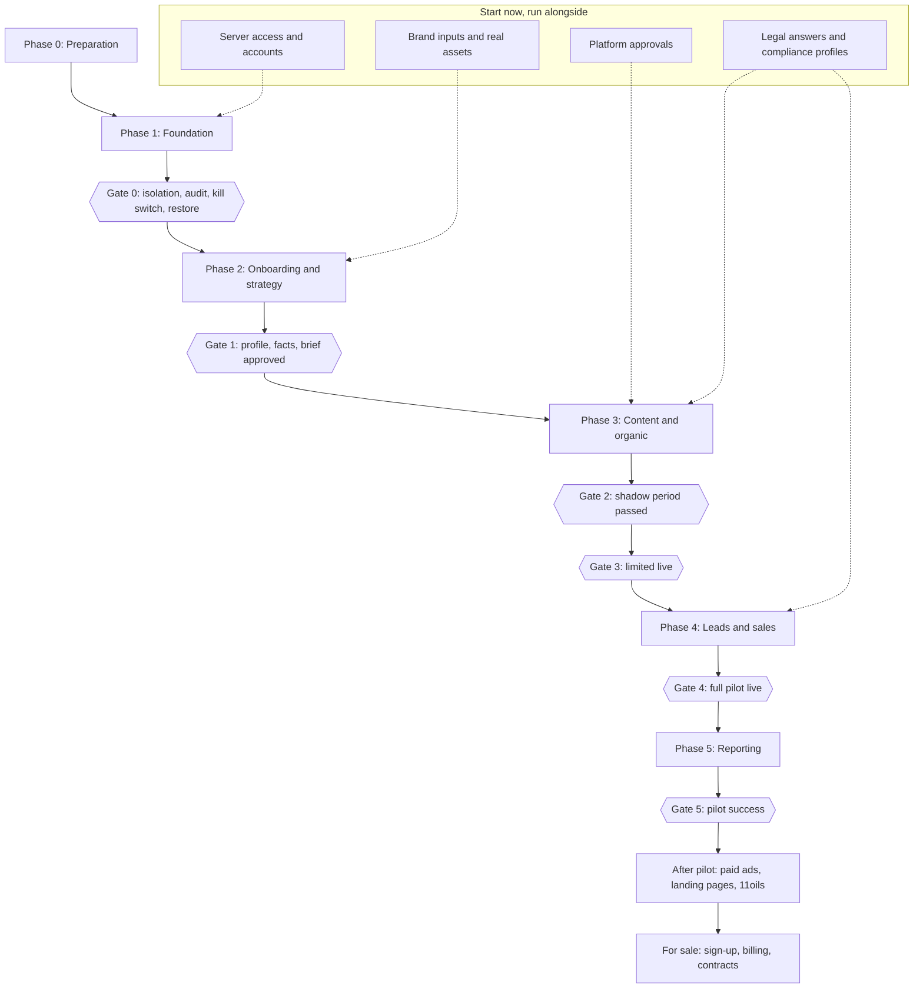

# AI Marketing Agency Platform — Phased Implementation Plan

| Document control | |
|---|---|
| Version | 1 |
| Status | **Approved** |
| Approved by | Sachin Tripathi, platform owner, on 2026-10-04 ("phased implementation plan approved") |
| Date | 2026-10-04 |
| Owner | Sachin Tripathi (platform owner) |
| Prepared by | Claude Code |
| Canonical source | `docs/plans/2026-10-04-phased-implementation-plan.md`. The Word file is generated from it. |
| Based on | Master PRD version 3, Architecture version 2, App flow version 2, Tech stack version 1, Content guidelines version 2, Phase 1 spec version 4, Database schema version 2. All approved. |

## 1. What this plan is

This plan sets the order of work from today to a product that can be sold: the phases, what each delivers, what must be true before the next one starts, and what is needed from the owner and when.

It works at two levels.

| Level | What it is | Where |
|---|---|---|
| **Phases and milestones** | The order of work, deliverables, gates and dependencies | This document |
| **Task-by-task build plans** | Exact files, tests and code steps for one milestone at a time | Written just before each milestone is built, from its approved spec. One per milestone, in `docs/plans/`. |

Phase 1 is planned to milestone level here because its spec is approved. Phases 2 to 5 are planned to step level; each needs its own spec before it can be planned further.

**No dates or durations are given.** They depend on two things not yet settled: who builds, and the deadline (owner items B4 and the open question on who builds). Section 2 states the assumption this plan makes, and sizes are relative.

## 2. Assumptions

| # | Assumption | If it is wrong |
|---|---|---|
| 1 | Claude Code builds, working from the approved documents. The owner reviews and approves at each review point. | If the owner's developers build instead, the phases and gates stay the same; the task plans are written as tickets for them. |
| 2 | Each phase has an approved spec before any of it is built | Not negotiable; it is how every document so far has been produced |
| 3 | Work is committed to the repository as it is done | Needs the owner's permission (item A8), which has not been given |
| 4 | Development does not wait for deployment prerequisites | Development runs on the developer's machine against a local database. Deployment waits for items A1 to A6. |
| 5 | The existing n8n workflows are never opened or changed | Fixed |

## 3. The phases at a glance

| Phase | Delivers | Ends at | Spec |
|---|---|---|---|
| **0 Preparation** | A committed baseline, a remote repository, the server inspected, accounts in place | Development can start | None needed |
| **1 Foundation** | Database with brand isolation, sign-in, roles, core service, dashboard shell, approval inbox, job queue, worker, ledgers, audit log, kill switch, one trivial agent | Gate 0 | Approved (version 4) |
| **2 Onboarding and strategy** | Research, tailored questionnaire, verified facts, safety rulebook, strategy brief, evaluation harness | Gate 1 | To be written |
| **3 Content and organic** | Creative agents, the checks, asset store, connection service, publishing to four channels, compliance profiles, search and AI visibility, review of live content | Gates 2 and 3 | To be written |
| **4 Leads and sales** | Lead capture, qualification, replies, booking, handover, partner routing, pipeline | Gate 4 | To be written |
| **5 Reporting** | Metrics, attribution, weekly and monthly reports | Gate 5, after the measured pilot period | To be written |
| **After pilot** | Paid ads with capped autonomy, landing pages, tests, email, influencer drafts, budgets, 11oils | Second brand live | To be written |
| **For sale** | Self-serve sign-up, billing, contracts, managed tier, client approvers, sync to a customer's CRM | First outside client | To be written |

## 4. Phase 0: Preparation

Small, but everything else rests on it.

| # | Step | Needs | Done when |
|---|---|---|---|
| 1 | Commit the seven approved documents as the baseline | Permission to commit (A8) | One commit holds every approved document and the document builder |
| 2 | Create a remote repository and push | Code hosting (A7) | The work exists somewhere other than one laptop |
| 3 | Inspect the shared server | Server access (A1) | Processors, memory, disk, load, and how n8n and the proxy are installed are written into the Phase 1 spec, and the load-test limits are fixed |
| 4 | Product API key for the model provider | A3 | A key with a spend limit is available to the developer's machine |
| 5 | Choose storage for backups and the audit export | A4, A5 | Bucket names and limited credentials exist |
| 6 | Sending address, error-tracking account, second alert channel, uptime checker | A6, A10, A11, A13 | Each account exists |
| 7 | DNS record for the dashboard | A2 | The name resolves to the server |

Steps 1 and 2 come before any code. Steps 3 to 7 can follow while Phase 1 is being built; all are needed before Phase 1 is deployed.

## 5. Phase 1: Foundation

Seven milestones, built in this order. Each ends with something that can be shown working and a review by the owner. Package numbers are those in the Phase 1 spec, section 18; test numbers are those in its section 17.

| Milestone | Packages | Shows at the end | Acceptance tests proven | Size |
|---|---|---|---|---|
| **M1 Ground** | 0 stack trial and pinning; 1 repository, build, tests, secret scanning | The pinned versions install and work together. The queue library's heartbeats, group limits and notification dispatch behave as the spec assumes on the pinned release. | 39, for the repository | M |
| **M2 Data and access** | 2 database, roles, isolation; 3 core service shell; 4 sign-in; 5 permissions | Two brands exist. A user signs in with a second factor and can reach only their own brand's data, through the API and directly in the database. | 1 to 5, 7 to 13 | L |
| **M3 Trust** | 6 audit log; 9 canonical payload and hash | Every action is in a tamper-evident log. A content payload hashes the same way in the application and the database. | 14 to 17, 35, 36 | M |
| **M4 Work engine** | 7 queue; 8 worker, attempts, model-call and cost ledgers, exchange rates | A job is created with its cause, claimed, survives a crash, and its model call and cost appear in both currencies. | 6, 24 to 29, 32 | L |
| **M5 Approvals** | 10 content versions and approvals; 11 notifications and alerts; 12 kill switch; 12a reminders, escalation, approval settings | A version is approved against its hash. Reminders and escalation run on a test clock. Nothing is approved by silence. The kill switch holds work. | 18 to 23, 30, 31, 38 | L |
| **M6 Proof** | 13 trivial agent; 14 n8n workflows and signed trigger; 15 dashboard screens | The owner signs in, starts the summary agent, sees the item in the inbox, approves it, and sees the run, cost and audit entries. The overdue pop-up and banner appear. | 33, 34, 37 | L |
| **M7 Ship** | 16 containers, proxy, secrets, backups; 17 monitoring; 18 acceptance run | The product runs at `marketing.sarathi.gvcc.in`. A backup has been restored. The load test passes without slowing n8n. | 39 for images and logs, 40, 41, and all 41 run together | M |

**Why this order**

- Isolation and sign-in come first because every later table and screen depends on them, and they are the hardest to add afterwards.
- The audit log and the content hash come before approvals, because approvals are recorded in one and bound to the other.
- The queue comes before the worker, and both before the trivial agent.
- The dashboard is built last in one piece, when every part it shows exists. Each earlier milestone is shown through its tests and the API.
- Deployment is last, but its prerequisites are gathered from the start (Phase 0).

**Owner items needed in Phase 1**

| When | Items |
|---|---|
| Before M1 | A8 permission to commit; A7 code hosting |
| Before M4 | A3 model provider key |
| Before M5 | A6 sending address; A11 second alert channel |
| Before M6 | A9 the owner's sign-in email and authenticator app |
| Before M7 | A1 server; A2 DNS; A4 and A5 storage; A10 error tracking; A13 uptime checker |

**Gate 0** is signed off by the owner when all 41 acceptance tests pass on the deployed product.

## 6. Phase 2: Onboarding and strategy

**Goal:** Aztek goes through onboarding for real and ends with an approved brand profile, verified-facts list and strategy brief.

| # | Step | Notes |
|---|---|---|
| 1 | Write and approve the Phase 2 spec | Includes the brand knowledge tables, provisional in the database schema |
| 2 | Agent definition format and release step | Versioned definitions; a version goes live only through the release step |
| 3 | Evaluation harness | Runs an agent version against its evaluation set; blocks release on failure |
| 4 | Fetch service | The only way an agent reads the web; blocks internal addresses |
| 5 | Research agent | Site, social profiles, search and AI visibility, competitors |
| 6 | Draft profile and tailored questionnaire | Items marked found, assumed or unknown; only the gaps are asked |
| 7 | Verified facts and safety rulebook screens | Each fact with source, confirmer and review date |
| 8 | Strategist agent and the strategy brief | The brief is a content item, approved against its hash |
| 9 | Agent questions | An agent asks instead of guessing; the answer resumes the work |
| 10 | Run onboarding for Aztek | With the owner answering the questionnaire |

**Owner items needed:** C1 social links, C2 brand material, C3 search and analytics access, C4 competitors, C5 questionnaire answers, C6 fact sign-off, C7 forbidden list, C8 examples of good and bad work.

**Gate 1:** brand profile, verified-facts list and strategy brief approved.

## 7. Phase 3: Content and organic

**Goal:** the agents produce Aztek's content, it passes every check, the owner approves it, and it is published on four channels.

| # | Step | Notes |
|---|---|---|
| 1 | Write and approve the Phase 3 spec | Chooses the publishing route, image, video and keyword tools, key management; extends the content payload with offers, products and the compliance profile version |
| 2 | Asset store and uploads | Real photos and footage, with consent and licence records |
| 3 | Creative agents | Copy, design, photo, video, motion; two to three variants each |
| 4 | The seven blocking checks and six quality scores | As in the content guidelines, section 14 |
| 5 | Compliance profiles | Drafted by the Legal agent, approved by the legal approver; publication blocked without one |
| 6 | Connection service | Account connection, token storage, refresh and revocation |
| 7 | Outbox dispatch, reconciliation and manual resolution | The explicit "unknown" state |
| 8 | Publishing to Instagram, Facebook, LinkedIn and YouTube | Through the approved route |
| 9 | Article delivery to the Aztek site | Draft-only endpoint; needs a small change to the Aztek site |
| 10 | Search and AI visibility | Audit, briefs, weekly tracking |
| 11 | Calendar approval and bulk approval | Weekly by default |
| 12 | Review of live content | Find, hold, notify, decide, act, record |
| 13 | Shadow period | Content into the inbox, nothing published; pass marks and thresholds set |
| 14 | Limited live, then all four channels | One channel at low frequency first |

**Owner items needed:** D1 to D4 platform approvals, D5 and D6 real assets and consent, D7 tool accounts, D8 link domains, D9 approval of the Aztek site change, D10 markets, F1 and F8 legal approver and compliance profiles, B5 tool budget.

**Gate 2:** the shadow period's evaluation passes and no unverified claim got past the checks. **Gate 3:** one channel publishing reliably.

## 8. Phase 4: Leads and sales

**Goal:** every lead is captured with its source, qualified, answered, and taken to an outcome.

| # | Step | Notes |
|---|---|---|
| 1 | Write and approve the Phase 4 spec | Lead tables depend on the legal answers on retention and storage |
| 2 | Inbound webhooks | Signature and replay checks |
| 3 | Lead records, touches and consent | Matched by phone or email |
| 4 | Link tagging and attribution capture | Every published link tagged automatically |
| 5 | Qualification agent | Classifies; does not write free replies |
| 6 | Approved answers and routine replies | Anything unusual goes to the approver |
| 7 | Booking, salesperson handover, partner routing | The three routes the owner chose |
| 8 | Partner outcome links | No account needed; "outcome unknown", never "lost" |
| 9 | Pipeline screens | Stages per lead type |
| 10 | Data export and deletion on request | |
| 11 | Reply sample review | Weekly |

**Owner items needed:** E1 to E10, F2 to F5, B7 to B9.

**Gate 4:** all four channels and lead handling live; each lead type reaches its route.

## 9. Phase 5: Reporting

**Goal:** the owner can see, each week, what was produced, what it led to and what it cost, in both currencies.

| # | Step |
|---|---|
| 1 | Write and approve the Phase 5 spec |
| 2 | Metric snapshots for every metric in PRD section 13 |
| 3 | Attribution results: lead credit and influence |
| 4 | Weekly and monthly reports, with drill-down |
| 5 | Home screen results block filled with real figures |
| 6 | Baseline comparison against the current team's figures |

**Owner items needed:** B1 baseline, B2 team cost, B3 approval time, B6 pilot length.

**Gate 5:** the PRD's success targets are met for the agreed consecutive period. The marketing staff can be redirected.

## 10. After the pilot, and for sale

| Stage | Order of work |
|---|---|
| **After pilot** | Budgets and cost ceilings; paid ads with capped autonomy; landing pages; tests on pages and creatives; email sequences; influencer drafts; 11oils onboarded as a second brand, which proves that a new brand needs no code change |
| **For sale** | Move to a separate server; independent security test; client approver role in use; contracts from approved templates; subscription billing; self-serve sign-up; sync to a customer's CRM; managed tier; first outside client |

Each needs its own spec. Moving to a separate server happens before the first outside client goes live, as the architecture requires.

## 11. Work that starts now and runs alongside

These do not depend on any code and are the most likely causes of delay.

| Track | Items | Needed by | Why start now |
|---|---|---|---|
| Platform approvals | D1 Meta verification, D2 Meta app review, D3 LinkedIn, D4 YouTube | Phase 3 | They take weeks and can be refused |
| Legal | F1 a lawyer, F2 to F5 answers, F8 compliance profiles | Phases 3 and 4 | Nothing can be published without an approved profile |
| Brand inputs | B1 to B9, C1 to C8 | Phases 2 and 5 | The success targets cannot be set without the baseline |
| Real assets | D5, D6 | Phase 3 | Gathering photos, footage and consents takes time |
| Server and accounts | A1 to A13 | Phase 1 deployment | Listed in Phase 0 |

## 12. How each phase is run

1. **Spec.** Written from the approved documents, reviewed, and approved by the owner.
2. **Task plan.** One per milestone, written just before it is built: exact files, tests and steps.
3. **Build.** Each package is built test-first, in small commits, and reviewed before the next starts.
4. **Acceptance.** The phase's acceptance tests are run together.
5. **Gate.** The owner signs off the gate.
6. **Deploy.** To the server, with a backup taken first.

**A package is done when** its tests pass, the full suite still passes, its code has been reviewed, and nothing it needs is left as a note to do later.

**Changes to an approved document** are made as a new version and approved again, as with every document so far.

**Progress** is recorded in `docs/progress.md`: each milestone's packages, their state, and the tests proven. From milestone M6 the dashboard itself also shows it.

## 13. Risks to the plan

| # | Risk | Effect | Response |
|---|---|---|---|
| 1 | A platform refuses or delays approval | Phase 3 publishing stalls for that channel | Start now; go live with the channels that are approved |
| 2 | Legal answers arrive late | Phase 3 cannot publish; Phase 4 cannot go live | Engage the lawyer during Phase 1 |
| 3 | The baseline is never supplied | Gate 5 cannot be judged | Capture it before Phase 3 ends, from the current team's last 90 days |
| 4 | The shared server lacks capacity | Phase 1 deployment moves to a separate server | Inspect in Phase 0 |
| 5 | A pinned library lacks a feature the design relies on | Rework in M4 | Proven in M1 before anything is built on it |
| 6 | Image and video quality is not good enough for the brand | Phase 3 creative work slows | Trial with real Aztek assets at the start of Phase 3 |
| 7 | One person reviews everything | Reviews queue up | Review points are at milestones, not at every package |

## 14. What is needed to start

| # | Needed | Status |
|---|---|---|
| 1 | Approval of this plan | Given, 2026-10-04 |
| 2 | Permission to commit (A8) | Open |
| 3 | Confirmation of who builds (assumption 1) | Taken as accepted with this plan: Claude Code builds, the owner reviews. The owner can change this at any time. |
| 4 | A remote repository (A7) | Open; can follow the first commit |

With items 1 to 3, Phase 0 step 1 and milestone M1 can begin. The next document would be the task plan for M1.
